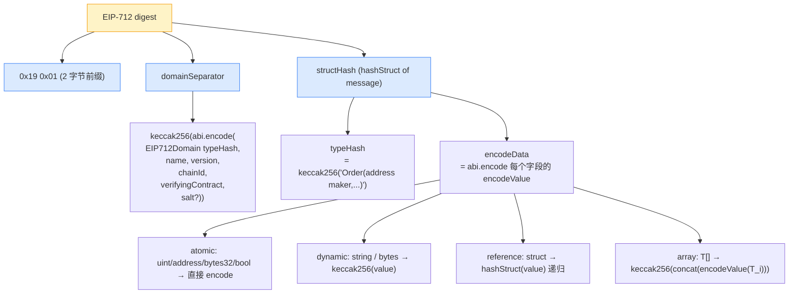
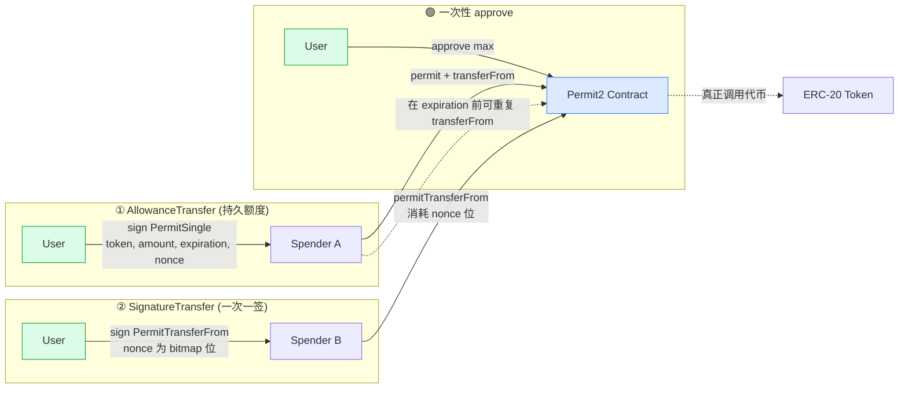
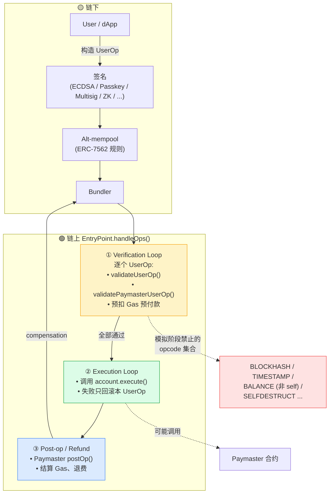

+++
date = '2026-04-23T10:00:00+08:00'
draft = false
title = 'DeFi 签名机制'
tags = ['web3']
+++

# DeFi 签名机制

> 签名是 Web3 世界里最被低估的基础设施。每一次你点击"Sign"，背后都是一段密码学历史的缩影。本文试图从底层原理出发，梳理 DeFi 中各类签名机制的发展脉络与安全边界。

---

## 目录

1. [密码学签名的本质](#一密码学签名的本质)
2. [ECDSA：以太坊的基石](#二ecdsa以太坊的基石)
3. [链上签名的演进](#三链上签名的演进)
   - [eth_sign：原始时代](#31-eth_sign原始时代)
   - [personal_sign：加盐的尝试](#32-personal_sign加盐的尝试)
   - [EIP-712：结构化时代](#33-eip-712结构化时代)
4. [授权签名的革命：Permit 家族](#四授权签名的革命permit-家族)
   - [ERC-20 Permit (EIP-2612)](#41-erc-20-permit-eip-2612)
   - [Permit2：Uniswap 的统一层](#42-permit2uniswap-的统一层)
5. [多签与阈值签名](#五多签与阈值签名)
   - [Multisig 合约（Gnosis Safe）](#51-multisig-合约gnosis-safe)
   - [MPC / TSS：链下协同](#52-mpc--tss链下协同)
6. [账户抽象时代的签名](#六账户抽象时代的签名)
   - [ERC-4337 与 UserOperation](#61-erc-4337-与-useroperation)
   - [EIP-7702：EOA 的逆袭](#62-eip-7702eoa-的逆袭)
   - [7702 与 4337 的生态博弈](#63-7702-与-4337-的生态博弈)
7. [其他签名原语：BLS、Schnorr、MuSig2](#七其他签名原语bls-schnorr-musig2)
   - [BLS：聚合签名与共识层的基石](#71-bls聚合签名与共识层的基石)
   - [Schnorr 与 MuSig2：比特币的新范式](#72-schnorr-与-musig2比特币的新范式)
8. [Session Key、Intent 与签名语义的上移](#八session-keyintent-与签名语义的上移)
   - [Session Key 与 ERC-7715](#81-session-key-与-erc-7715)
   - [Intent 协议的签名模型：CoW、UniswapX、Across](#82-intent-协议的签名模型cowuniswapxacross)
9. [签名的安全边界与攻击面](#九签名的安全边界与攻击面)
10. [跨链与 L2 的签名工程](#十跨链与-l2-的签名工程)
11. [未来展望：签名的下一站](#十一未来展望签名的下一站)
12. [签名类型速查表](#十二签名类型速查表)

---

## 一、密码学签名的本质

在理解 DeFi 中的各类签名之前，我们需要回到最根本的问题：**签名是什么？**

密码学签名解决的是一个古老的问题：**如何在不可信的信道中，证明一条消息确实来自某个特定的发送者，且未被篡改？**

传统数字签名基于非对称密码学，由三个算法构成：

```
KeyGen()  → (私钥 sk, 公钥 pk)
Sign(sk, m) → 签名 σ
Verify(pk, m, σ) → {true, false}
```

其安全性依赖于数学难题：拥有公钥的人无法在多项式时间内推导出私钥。在区块链语境中，这意味着：

- **私钥** = 你的身份与资产控制权
- **签名** = 你对某个操作的授权证明
- **验证** = 任何人（包括智能合约）都可以核验

> 🔑 **核心洞察**：区块链上的"账户"本质上是密钥对的映射。你的钱包地址是公钥的哈希，所有权的证明就是用私钥对消息签名。

---

## 二、ECDSA：以太坊的基石

以太坊（继承自比特币）采用的是 **ECDSA**（Elliptic Curve Digital Signature Algorithm），基于 **secp256k1** 椭圆曲线。

### 为什么是 secp256k1？——一段路径依赖史

在进入数学细节之前，有一个值得先问的问题：以太坊为什么要用一条相对冷门的曲线？

secp256k1 在 NIST 的"建议曲线"列表中属于 **Koblitz 曲线**（参数非随机），长期被主流密码学界**冷落**——大多数工业协议（TLS、SSH、smart card）用的是 `NIST P-256`（secp256r1）。中本聪在 2008 年为比特币选择 secp256k1，学界普遍的推测是两个原因：

1. **避开 NIST 的"魔数"嫌疑**：P-256 的参数由 NIST 提供且不可解释来源（Dual_EC_DRBG 后门事件后，这种"不可审计的常数"成了密码学圈的禁忌）
2. **实现性能更优**：Koblitz 结构（曲线系数 `a = 0`）让点加/倍点公式更简洁，在当时的硬件上签名/验签更快

以太坊 2015 年创世时直接**复用**了比特币的这条曲线——这不是技术选型，而是**生态复用**：

- 硬件钱包（Ledger、Trezor）的安全芯片原生支持 secp256k1
- 比特币生态现成的库（libsecp256k1）可以直接搬
- 矿工/节点已经有了对应的优化

于是 secp256k1 成了整个以太坊系的"路径锁定"。

### 对照：Ed25519（Solana / Aptos / NEAR 在用）

| 维度 | ECDSA + secp256k1 | EdDSA + Ed25519 |
|------|-------------------|-----------------|
| 签名大小 | 64 字节（不含 `v`） | 64 字节 |
| 公钥大小 | 33 字节（压缩）/ 65 字节 | 32 字节 |
| 随机 nonce | **必需**，失误即泄露私钥 | **确定性**（由 sk + m 派生） |
| 批验证 | 困难 | 原生支持，吞吐量近 3–5× |
| 侧信道 | 模逆、分支多，难恒时 | 设计上恒时、无分支 |
| 标准化历史 | 主流但有 Dual_EC 阴影 | Djb 设计，学界公认干净 |
| 链上验证 | `ecrecover` 预编译 | 需 precompile 或昂贵 Solidity 实现 |

**Ed25519 的两大杀手锏：**

- **确定性 nonce**：`k = HMAC(sk, m)`，同一私钥+同一消息永远得到同一签名。PS3 当年之所以被破解，正是因为索尼把 ECDSA 的 `k` 设成了常量——Ed25519 从协议层面消灭了这类失误
- **批验证**：验证 N 条独立签名只需 O(N) 但常数极小的一次大运算，对高吞吐链（Solana）至关重要

**以太坊能切换吗？** 几乎不可能。所有 EOA 地址都是 `keccak256(pubkey)[12:]`，切曲线=整个地址体系重来。真正的妥协方案是：

- **ERC-4337 / EIP-7702** 让合约账户自定义验签逻辑，可以用 Ed25519、P-256、BLS 等
- **RIP-7212** 已给 P-256 上预编译（为 Passkey/WebAuthn 打路），但 Ed25519 precompile 一直没落地

换句话说——我们不是"在忍受 ECDSA"，而是**让账户抽象在 ECDSA 之上"绕过"它**。

### 数学基础

secp256k1 曲线方程：

```
y² = x³ + 7  (在有限域 𝔽_p 上)
```

其中 `p = 2²⁵⁶ - 2³² - 977`，群的阶 `n ≈ 1.158 × 10⁷⁷`。

**签名过程（简化）：**

1. 生成随机数 `k`（nonce，极其关键）
2. 计算 `R = k × G`，取 `r = R.x mod n`
3. 计算 `s = k⁻¹ × (hash(m) + r × sk) mod n`
4. 签名为 `(r, s)`

**验证过程：**

1. 计算 `u₁ = hash(m) × s⁻¹ mod n`
2. 计算 `u₂ = r × s⁻¹ mod n`
3. 计算 `P = u₁ × G + u₂ × pk`
4. 验证 `P.x mod n == r`

### 以太坊的扩展：recovery bit `v`

以太坊在标准 ECDSA 之上增加了一个恢复参数 `v`（值为 27 或 28，后来 EIP-155 之后为 `chainId × 2 + 35/36`）。

这使得签名从 `(r, s)` 变为 `(v, r, s)`，允许从签名中**恢复**出公钥，而无需事先知道公钥。这个特性对链上验证至关重要：

```solidity
address signer = ecrecover(messageHash, v, r, s);
```

`ecrecover` 是以太坊的预编译合约，Gas 极低，是 DeFi 签名验证的基础原语。

### ECDSA 的致命弱点：nonce 复用

如果两次签名使用了相同的随机数 `k`，私钥将被完全泄露：

```
s₁ = k⁻¹(h₁ + r·sk)
s₂ = k⁻¹(h₂ + r·sk)

→ k = (h₁ - h₂) / (s₁ - s₂)
→ sk = (s₁·k - h₁) / r
```

这并非理论漏洞——PlayStation 3 就因此被破解，多个早期比特币库因 nonce 生成不当导致私钥泄露。

### `ecrecover` 的 `address(0)` 陷阱

`ecrecover` 是 EVM 的预编译合约（地址 `0x01`），但它有一个容易被忽视的"沉默失败"行为：

```solidity
// 当 (v, r, s) 在数学上不对应任何有效公钥时
address signer = ecrecover(hash, v, r, s);
// signer == address(0)，但不会 revert！
```

这带来了一个经典的逻辑漏洞模式：

```solidity
// 反面教材：未检查 address(0)
function claim(bytes32 hash, uint8 v, bytes32 r, bytes32 s) external {
    address signer = ecrecover(hash, v, r, s);
    require(signer == owner, "not owner");   // ❌ 有问题
    // ...
}
```

如果合约里的 `owner` **尚未初始化**（仍为 `address(0)`），攻击者可以构造一组**无效签名**让 `ecrecover` 返回 `address(0)`，从而通过 `signer == owner` 的检查——这在代理合约忘记调用 `initialize()`、或多阶段部署的窗口期里，是致命的。

**历史事故：**
- 早期一些 airdrop / claim 合约因此被薅干
- 某些未初始化的 Gnosis Proxy 曾暴露同类风险

**正确姿势——永远加 `address(0)` 检查：**

```solidity
address signer = ecrecover(hash, v, r, s);
require(signer != address(0), "invalid sig");
require(signer == owner, "not owner");
```

这正是 **OpenZeppelin 的 `ECDSA.recover`** 存在的根本原因。它在一个函数里帮你把**签名长度、`s` 上界、`v` 范围、`address(0)` 返回值**四件事全检查完：

```solidity
// OpenZeppelin 的安全封装（简化）
function recover(bytes32 hash, bytes memory sig) internal pure returns (address) {
    // ... 分支解析 65 / 64 字节签名
    if (uint256(s) > 0x7FFFF...A0) revert InvalidSignatureS();
    address signer = ecrecover(hash, v, r, s);
    if (signer == address(0)) revert InvalidSignature();
    return signer;
}
```

> 💡 **工程建议**：在合约里永远使用 `ECDSA.recover`，**永远不要**直接调用 `ecrecover`。这条规则应该和"不要直接写 `call.value`"同等重要。

---

## 三、链上签名的演进

### 3.1 `eth_sign`：原始时代

以太坊最初的签名方法 `eth_sign` 非常简单粗暴：对传入的 32 字节数据**不加任何前缀、直接签名**。

```javascript
// 危险！直接签名原始 32 字节数据
eth.sign(account, dataHash)
```

**工作原理（早期危险版本）：**

```
sign(data)   // data 通常是一个 32 字节值
```

**问题所在：**

以太坊交易的签名对象正是 `keccak256(rlp(tx))`——一个 32 字节的哈希。这意味着攻击者可以**直接构造一笔恶意交易、计算其哈希**，然后把这 32 字节哈希作为"数据"丢给用户签名。用户在钱包里只看到一串无意义的十六进制，而一旦签名，这个签名就是该交易的合法签名，攻击者可以直接广播上链。

换言之：**`eth_sign` 没有域隔离，它的输出和交易签名在格式上完全无法区分**。

这类攻击被称为 **"盲签名"攻击**，在 DeFi 钓鱼事件中屡见不鲜。

> ⚠️ **现实风险**：正因为如此，主流钱包（MetaMask、Rabby 等）已默认对 `eth_sign` 打出红色警告或直接禁用，硬件钱包厂商（如 Ledger）也长期呼吁用户关闭 "blind signing"。凡是要求你用 `eth_sign` 签一串看不懂的 32 字节哈希的站点，基本可以直接判定为钓鱼。

### 3.2 `personal_sign`：加盐的尝试

为了缓解 `eth_sign` 的问题，以太坊引入了 `personal_sign`（也称 `eth_sign` 的"安全版"）。

**工作原理：**

```
sign(keccak256("\x19Ethereum Signed Message:\n" + len(message) + message))
```

加入前缀 `"\x19Ethereum Signed Message:\n"` 的目的是：使签名结果**不可能是有效的以太坊交易**（因为交易使用 RLP 编码，不会以 `\x19` 开头）。

```javascript
// 相对安全的个人签名
web3.eth.personal.sign("Hello, World!", account, password)
```

**改进：**
- 签名内容对用户可见（显示为文本）
- 无法被复用为交易签名

**局限：**
- 仍然是非结构化的，用户看到的消息可能被混淆
- 无法表达复杂的结构化意图
- 没有域隔离，同一签名可能在不同合约/链上被重放

### 3.3 EIP-712：结构化时代

**EIP-712** 是链上签名史上最重要的标准之一，于 2017 年提出，2020 年后被广泛采用。

**核心思想：** 将签名内容结构化，让用户（和钱包）能够以人类可读的方式显示签名内容。

**三层结构：**

```
完整签名哈希 = keccak256(
    "\x19\x01" +
    domainSeparator +      // 域分隔符
    structHash             // 结构体哈希
)
```



**域分隔符（Domain Separator）：**

```solidity
bytes32 DOMAIN_SEPARATOR = keccak256(abi.encode(
    keccak256("EIP712Domain(string name,string version,uint256 chainId,address verifyingContract)"),
    keccak256(bytes("MyProtocol")),
    keccak256(bytes("1")),
    block.chainid,     // 防止跨链重放
    address(this)      // 防止跨合约重放
));
```

**结构体类型哈希示例：**

```solidity
// 定义结构体类型
bytes32 constant ORDER_TYPEHASH = keccak256(
    "Order(address maker,address taker,uint256 amount,uint256 expiry)"
);

// 对具体实例求哈希
bytes32 structHash = keccak256(abi.encode(
    ORDER_TYPEHASH,
    order.maker,
    order.taker,
    order.amount,
    order.expiry
));
```

### EIP-712 的四条"踩坑必读"规则

自己手写 EIP-712 的开发者，90% 的 bug 都集中在下面这四处——它们在规范里白纸黑字，但教程里往往一笔带过。

**① `string` / `bytes` 不能直接塞进 `abi.encode`**

对**动态类型**，规范要求先 `keccak256` 成 32 字节再参与 `encodeData`：

```solidity
bytes32 MAIL_TYPEHASH = keccak256("Mail(address from,string contents)");

// ❌ 错误：直接 encode 了 string
keccak256(abi.encode(MAIL_TYPEHASH, from, contents));

// ✅ 正确：先 hash 再 encode
keccak256(abi.encode(
    MAIL_TYPEHASH,
    from,
    keccak256(bytes(contents))   // ← 必须！
));
```

忘了这一步的合约，会和所有按规范签名的客户端（MetaMask、ethers）产生**哈希不一致**——症状是"签名总是不通过"，却看不出任何 Solidity 层面的错误。

**② 嵌套 struct：typeHash 字符串必须按字母序拼接子类型**

```solidity
struct Person { string name; address wallet; }
struct Mail   { Person from; Person to; string contents; }

// typeHash 字符串的拼接规则：
// 1. 主类型放最前
// 2. 所有"被引用到的"子类型按 ASCII 升序追加
// 3. 每个类型定义完整写一遍，不重复

string constant MAIL_TYPE = "Mail(Person from,Person to,string contents)Person(string name,address wallet)";
//                            ├────────── 主类型 ───────────┤├────── 子类型 ──────┤

bytes32 MAIL_TYPEHASH = keccak256(bytes(MAIL_TYPE));
```

**字母序**是最容易出错的点——如果同时有 `Person` 和 `Asset` 两个子类型，必须是 `Mail(...)Asset(...)Person(...)`，不是代码里的定义顺序。

**③ 数组类型：`T[]` 的 encode 是"元素 encodeValue 的拼接再 keccak256"**

```solidity
struct BatchOrder {
    address trader;
    Order[] orders;     // ← 数组字段
}

// typeHash 字符串里写 "Order[]"
string constant BATCH_TYPE = "BatchOrder(address trader,Order[] orders)Order(...)";

// 对数组值求 hash：
bytes32 ordersHash;
{
    bytes memory buf;
    for (uint i = 0; i < orders.length; i++) {
        buf = bytes.concat(buf, hashStruct(orders[i]));  // 每个元素 encodeValue
    }
    ordersHash = keccak256(buf);
}

bytes32 structHash = keccak256(abi.encode(
    BATCH_TYPEHASH,
    trader,
    ordersHash          // ← 用 hash，不是 orders 本身
));
```

固定长度数组 `T[N]` 规则相同。**常见错误**是把 `orders.length` 或者 `abi.encode(orders)` 当成 hash 参数。

**④ 同名不同定义会悄悄"签错东西"**

EIP-712 按**字段名+类型**确定 typeHash。如果合约里把 `Order(uint256 amount,address token)` 改成了 `Order(address token,uint256 amount)`（字段顺序变了），typeHash 完全不同——但编译器不会报错，钱包也不会察觉。升级合约时务必锁定 typeHash 字符串。

> 🛠️ **调试利器**：把 `hashStruct` 每一步的中间值 `console.log`，对照 ethers 的 `TypedDataEncoder.hashStruct` 输出。两边第一个不一致的字节，就是 bug 所在。

**EIP-712 的革命性意义：**

| 维度 | 改进前 | EIP-712 |
|------|--------|---------|
| 可读性 | 十六进制哈希 | 结构化字段展示 |
| 跨链防护 | 无 | chainId 绑定 |
| 跨合约防护 | 无 | verifyingContract 绑定 |
| 类型安全 | 无 | typeHash 编码 |
| 钱包支持 | 基础显示 | MetaMask 等结构化展示 |

Uniswap、OpenSea（Seaport）、Aave、Compound 等主流协议均基于 EIP-712 构建其签名体系。

---

## 四、授权签名的革命：Permit 家族

### 4.1 ERC-20 Permit (EIP-2612)

传统 ERC-20 授权需要两笔交易：

```
1. approve(spender, amount)  → 链上交易，需要 Gas
2. transferFrom(...)         → 实际操作
```

**EIP-2612** 引入了 `permit` 函数，允许通过签名完成授权，将两笔交易合并为一笔：

```solidity
function permit(
    address owner,
    address spender,
    uint256 value,
    uint256 deadline,
    uint8 v,
    bytes32 r,
    bytes32 s
) external;
```

**签名内容（EIP-712 格式）：**

```solidity
bytes32 PERMIT_TYPEHASH = keccak256(
    "Permit(address owner,address spender,uint256 value,uint256 nonce,uint256 deadline)"
);
```

**用户体验流程：**

```
用户离线签名 → 协议代替用户提交 permit + 操作（一笔交易）
           → 用户无需持有 ETH 支付 Gas（Gas 可由协议代付）
```

**nonce 机制：** 每个用户的 nonce 单调递增，防止重放攻击。

**DAI 的 Permit 变体：** DAI 早于 EIP-2612 就引入了类似机制，但使用 `allowed`（布尔值）而非具体金额，且 TYPEHASH 不同，因此与标准并不兼容（两者属于独立实现）。

**广泛采用：** USDC（v2 及以上）、DAI（非标准变体）、UNI、部分跨链/分叉版本的 WETH、Aave v3 的 aToken 等均支持。需要注意的是：**USDT 和以太坊主网上的 WETH9 均不支持 permit**，这也是 Permit2 诞生的重要动因之一。

### 4.2 Permit2：Uniswap 的统一层

**问题：** 并非所有 ERC-20 代币都实现了 EIP-2612 Permit（特别是 USDT），且各协议的授权管理分散，用户需要对每个协议分别 approve。

**解决方案：** Uniswap Labs 于 2022 年底部署了 **Permit2** 合约，作为一个**通用授权中间层**。

**核心设计：**

```
用户 → approve(Permit2合约, max)   // 一次性，对所有协议
协议 → 使用 Permit2 签名调用      // 无需再次 approve
```



Permit2 提供两种核心机制：

**① AllowanceTransfer（额度转账）：**

```solidity
// 签名授权特定协议使用特定数量
struct PermitSingle {
    PermitDetails details;   // token, amount, expiration, nonce
    address spender;
    uint256 sigDeadline;
}
```

用户签名后，被授权协议可在额度范围和时间内发起转账，无需再次交互。

**② SignatureTransfer（签名转账）：**

```solidity
// 单次使用，签名即转账
struct TokenPermissions {
    address token;
    uint256 amount;
}

struct PermitTransferFrom {
    TokenPermissions permitted;
    address spender;
    uint256 nonce;
    uint256 deadline;
}
```

每次转账都需要新签名，不持久化授权，更安全但需要更频繁签名。

### Permit2 的关键创新：位图 nonce（而非递增计数器）

EIP-2612 用的是"每个地址一个单调递增的 `nonce`"：必须按顺序签、按顺序上链，中间少一个就卡住——这对"用户签完就挂单、由 Filler 在未来某个时刻择机执行"的场景（UniswapX、限价单）极度不友好。

**Permit2 的解法：把每个 nonce 看成一张 256×? 的位图。**

```solidity
// Permit2 核心存储
mapping(address => mapping(uint256 => uint256)) public nonceBitmap;
//      owner            wordPos       bitmap(256 位)

// 用户签名里的 nonce 是一个 uint256，被拆成两部分：
//   wordPos = nonce >> 8     (高 248 位，选中哪一个 word)
//   bitPos  = nonce & 0xff   (低 8 位，选中 word 内的哪一位)
```

消费一个 nonce 时，合约**原子地翻转对应 bit**：

```solidity
function _useUnorderedNonce(address from, uint256 nonce) internal {
    (uint256 wordPos, uint256 bitPos) = (nonce >> 8, nonce & 0xff);
    uint256 bit = 1 << bitPos;
    uint256 flipped = nonceBitmap[from][wordPos] ^= bit;
    if (flipped & bit == 0) revert InvalidNonce();  // 该位原本就是 1 → 已用过
}
```

**这个设计带来的三个实际能力：**

1. **乱序签名**：用户可以一口气签 `nonce = 5, 17, 42`，让 Filler 随机挑哪个先上链，不必按顺序
2. **并行签名**：前端为不同交互分配不同的 `wordPos`（例如"swap 用 word 0、Permit NFT 用 word 1"），互不阻塞
3. **批量作废**：要取消一批签名？`invalidateNonces(wordPos, mask)` **一次翻转 256 位**，Gas 只需翻一个 storage slot

相比之下，EIP-2612 要"作废一个未用签名"只能手动发一笔消费 nonce 的垃圾交易——Permit2 的位图让这件事从"一个签名一笔 Gas"降到了"一个 word 一笔 Gas"。

> 💡 **开发者陷阱**：前端务必**避免** nonce 分配冲突。常见做法是以 `(domain, randomWord)` 为 `wordPos`、低 8 位做计数器；千万不要所有签名都挤在 `wordPos = 0` 上。

**Permit2 的创新点：**

| 特性 | 传统 approve | EIP-2612 Permit | Permit2 |
|------|-------------|-----------------|---------|
| 支持所有 ERC-20 | ✅ | ❌（需代币实现） | ✅ |
| 无 Gas 授权 | ❌ | ✅ | ✅ |
| 统一入口 | ❌ | ❌ | ✅ |
| 批量授权 | ❌ | ❌ | ✅ |
| 时间限制 | 手动 | ✅ | ✅ |
| 额度限制 | ✅ | ✅ | ✅ |

> **安全影响：** Permit2 合约不可升级（immutable），已成为 DeFi 的关键基础设施。但它也意味着用户需要信任这个合约——一旦对 Permit2 的 approve 被钓鱼利用，攻击面扩大为用户在 Permit2 上的所有授权。

---

## 五、多签与阈值签名

### 5.1 Multisig 合约（Gnosis Safe）

多签（Multisig）是 DeFi 协议金库管理的标准实践。以 **Gnosis Safe**（现 Safe）为例，它实现了 **M-of-N** 签名模型：

```
N 个签名者中，需要 M 个签名才能执行操作
```

**签名流程：**

```
提案者构造交易 → 各签名者用 EIP-712 签名 → 达到 M 个签名后提交链上执行
```

Safe 的交易哈希格式（EIP-712）：

```solidity
bytes32 SAFE_TX_TYPEHASH = keccak256(
    "SafeTx(address to,uint256 value,bytes data,uint8 operation,"
    "uint256 safeTxGas,uint256 baseGas,uint256 gasPrice,"
    "address gasToken,address refundReceiver,uint256 nonce)"
);
```

**签名模式：**

Safe 支持三种签名收集方式：
1. **链上签名**（`approveHash`）：签名者在链上提交哈希认可
2. **链下 ECDSA 签名**：最常用，通过接口聚合
3. **合约签名（ERC-1271）**：签名者本身是智能合约

### 5.2 MPC / TSS：链下协同

**MPC（Multi-Party Computation）** 和 **TSS（Threshold Signature Scheme）** 是更先进的多方签名方案，核心思想是：**私钥从未以完整形式存在**。

**与 Multisig 的对比：**

| 维度 | Multisig | MPC/TSS |
|------|----------|---------|
| 实现层 | 链上合约 | 密码学协议 |
| Gas 成本 | 与签名数量线性相关 | 与普通交易相同 |
| 隐私性 | 签名者可见 | 签名者不可见 |
| 链的支持 | 需要合约支持 | 任意链 |
| 复杂度 | 简单 | 复杂，实现难度高 |

**TSS 的数学基础：**

密钥生成：N 个参与方通过分布式密钥生成（DKG），各持有秘密份额 `sk_i`，满足：
```
sk = f(sk_1, sk_2, ..., sk_n)  // 从未在任何节点上组装
```

签名时，T 个参与方协同计算签名，每人只使用自己的份额。

### 协议演进：从 GG20 的陨落到 DKLs23

TSS 协议的发展比很多人以为的更跌宕，生产环境里**不应该再用 GG20**。

| 协议 | 年代 | 状态 | 备注 |
|------|------|------|------|
| **GG18** (Gennaro-Goldfeder) | 2018 | ⚠️ 多处漏洞 | 早期开源实现（tss-lib）的默认选择 |
| **GG20** | 2020 | ❌ **2023 年 TSSHOCK CVE** | 零知识证明校验不完整，恶意参与方可提取私钥（Verichains / Fireblocks 披露） |
| **CGGMP21** (Canetti-Gennaro-Goldfeder-Makriyannis-Peled) | 2021 | ✅ | 引入 UC-secure 分析，修复 GG20 问题 |
| **CMP** (Canetti-Makriyannis-Peled) | 2020 | ✅ | Paillier 同态 + 零知识审计 |
| **DKLs23** (Doerner-Kondi-Lee-Shelat) | 2023 | ✅ **当前主流** | OT-based，无需 Paillier/类群，轮数与带宽大幅降低 |
| **Lindell 17 / 22** | 2017/2022 | ✅ | 两方 (2-of-2) 场景经典方案 |

**GG20 到底怎么出事的？** 简化地说，GG20 在其中一个零知识证明里**没校验范围**——恶意节点可以精心构造一个看起来合法的消息，让诚实节点在协同签名过程中泄露足够的私钥"比特片段"，若干轮后完全还原 `sk`。这在 2023 年被 Verichains 定名为 **"TSSHOCK"**，Fireblocks、Binance 等多家托管方紧急升级到 CGGMP / DKLs23。

**DKLs23 为什么会胜出？**
- **无需 Paillier 加密**（Paillier 算术在移动设备上极慢）
- 通信轮数少（GG20 是 8 轮、DKLs23 是 3 轮）
- 签名大小与普通 ECDSA 相同，兼容 secp256k1
- 已被 Silent Protocol、tss-lib v2、Fordefi 等采用

### MPC 钱包真正的工程痛点

学术论文只管"签出一个签名"，但 MPC 钱包在生产环境面对的问题远不止这些——下面这几项每一项都能让项目翻车：

**① 密钥份额轮换（Proactive Refresh）**

持久运行的系统里，**每个份额都在慢慢"泄露"**——侧信道、云服务商日志、临时设备入侵。Proactive Security 的思想是：**每隔一段时间让所有参与方运行一个重随机化协议**，在保持 `sk` 不变的前提下，把 `(sk_1, ..., sk_n)` 替换成一组全新的、与旧份额统计独立的新份额。

- 攻击者攻破一台机器拿到 `sk_1^(t)`
- 只要没在同一轮次内拿到 `T` 个份额，轮换后 `sk_1^(t+1)` 与 `sk_1^(t)` 无关，之前的入侵作废
- **相当于给私钥装了"自我疗愈"能力**

生产系统每天甚至每小时做一次 refresh 是常态。GG20 对 refresh 的支持不够干净，这也是行业迁移的动因之一。

**② 动态成员：加入 / 踢出 / 阈值变更**

用户升级套餐（2-of-3 → 3-of-5）、合伙人离职——阈值参数不能硬编码。这需要 **Share Resharing 协议**：旧委员会协同地把 `sk` 重新 secret-share 给一个新的委员会，整个过程 `sk` 不暴露。

DKLs23 / CGGMP 都提供干净的 resharing；GG18/20 要靠论文外的"补丁"，容易出错。

**③ 份额备份与社交恢复**

用户弄丢手机怎么办？常见做法：
- **客户端侧 Shamir 再分享**：把 `sk_1` 二次拆分后给家人 / 云存储
- **server-assisted**：引入可信云作为第三个份额持有者，丢手机时用 email + 2FA 恢复

但这一层 **不属于 TSS 本身**，属于产品设计，也是合规 / 隐私冲突最集中的地方。

**④ 并发签名的 "nonce reuse across sessions"**

多个签名会话并行时，一不小心就会让不同会话复用同一批 ECDSA 的 `R = kG`——这在 TSS 里同样是**单点泄露私钥**的致命错误。学术协议假设"串行签名"，工程实现必须加一层会话 ID 与重放保护。

**应用场景：**
- **托管钱包**：Fireblocks（DKLs23）、Coinbase Custody、BitGo（CGGMP）
- **智能合约钱包**：Safe Wallet 的 MPC 方案（Safe{Signer}）
- **跨链桥**：Axelar 早期、Multichain（GG18 时代，后来也是出事原因之一）
- **CEX 冷热钱包**：Binance、OKX 的热钱包链下分布式托管

> ⚠️ **尽调提示**：评估一个 MPC 产品时，至少问清三件事——**用的是哪个协议（拒绝 GG18/20）**、**是否支持 proactive refresh**、**share resharing 是否开箱即用**。任何一项答不上，都说明团队还停在 2020 年。

---

## 六、账户抽象时代的签名

### 6.1 ERC-4337 与 UserOperation

**ERC-4337** 是以太坊账户抽象的里程碑，于 2023 年正式在主网部署。它将"操作意图"与"签名验证"解耦，允许智能合约账户自定义签名逻辑。

**核心数据结构：**

```solidity
struct UserOperation {
    address sender;           // 智能合约钱包地址
    uint256 nonce;
    bytes initCode;           // 钱包部署代码（首次）
    bytes callData;           // 实际要执行的操作
    uint256 callGasLimit;
    uint256 verificationGasLimit;
    uint256 preVerificationGas;
    uint256 maxFeePerGas;
    uint256 maxPriorityFeePerGas;
    bytes paymasterAndData;   // Paymaster（代付 Gas）
    bytes signature;          // 自定义签名数据
}
```

**签名验证流程：**



### EntryPoint 的两阶段执行：为什么 4337 能安全地让 Bundler 垫付 Gas

ERC-4337 最精妙的设计就是 `handleOps` 内部的**两阶段**结构：

**Phase 1：Verification Loop**（一口气跑完所有 UserOp 的校验）
- 对每个 UserOp：调用 `account.validateUserOp()`，拿到 `validationData`（包含有效期、aggregator 等）
- 如果有 Paymaster：再调用 `paymaster.validatePaymasterUserOp()`
- EntryPoint **预扣**每个 UserOp 的 `maxGasCost` 到 account/paymaster 的 deposit 余额
- 任一 UserOp 的验证 revert → **整笔 handleOps 交易失败**（Bundler 自己承担 Gas，所以 Bundler 必须先在链下模拟）

**Phase 2：Execution Loop**
- 再次遍历 UserOp，调用 `account.execute(callData)`
- **单个 UserOp 执行失败只回滚本身**，不影响同批次的其他 UserOp（这一点与普通交易的 "all-or-nothing" 截然不同）
- 若使用 Paymaster，最后调用 `paymaster.postOp()` 做结算（支持"先消费代币、事后按价换算 ETH"这类复杂会计）

这个两阶段设计回答了一个核心问题：**Bundler 为什么敢把一堆陌生 UserOp 打包成自己发出的交易？** 因为 Phase 1 的成本极低、且验证无副作用，Bundler 可以在本地先模拟整批 UserOp 的 verification loop，只要通过就几乎肯定能赚到 Gas 差价。

### ERC-7562：Bundler 的 mempool 规则——一部"opcode 禁令清单"

这是 4337 里最被低估的一块拼图。天真地想，Bundler 的 mempool 跟普通以太坊 mempool 没区别——但 UserOp **尚未上链时的模拟**，和**真正被打包时的链上行为**必须一致，否则攻击者可以让 Bundler 白干活（Griefing）。

ERC-7562（从 4337 原版规则中剥离出来的规范）规定了**验证阶段禁止使用的 opcode 集合**：

| 类别 | 禁用 opcode | 原因 |
|------|------------|------|
| 时间/区块 | `BLOCKHASH`, `NUMBER`, `TIMESTAMP`, `BASEFEE`, `GASLIMIT`, `COINBASE`, `DIFFICULTY` / `PREVRANDAO` | 模拟与实际上链间隔可能跨块，状态变了 |
| 跨账户读取 | 对**非 sender/paymaster** 的 `BALANCE`, `EXTCODE*`, `SLOAD` | 别人改了状态，你的签名会"无故失效"，攻击者可批量让 Bundler 白白打包 |
| 破坏性 | `CREATE2`（仅限 factory 的首次部署）、`SELFDESTRUCT` | 账户地址必须可预测稳定 |
| 外部调用 | `CALL`/`STATICCALL` 返回值不得依赖于对方地址的其他状态 | 同上，防止 DOS |

**Storage access 规则更细**：
- sender account 可以自由读写自己的 storage
- paymaster 只能读写自己的 storage
- 对其他合约：**只允许读取**；且被读槽必须由 UserOp 里的某个字段"关联到"（associated storage），否则模拟出的结果不可信

违反这些规则的 UserOp，Bundler 会拒绝进 mempool——这是 4337 生态"好公民"的准入门槛。Stackup、Alchemy、Pimlico、Voltaire 都按 ERC-7562 实现，它们之间的 mempool 是**可互操作**的。

### Paymaster：代付的三种典型模式

Paymaster 是 4337 里 UX 改善最直接的部分——它让"用户用 USDC 付 Gas"、"第一次用 DApp 免费"成为可能。

**模式 ① Verifying Paymaster（项目方代付）**

```solidity
function validatePaymasterUserOp(...) external returns (bytes memory context, uint256 vd) {
    // 项目方链下签一个"我同意代付这笔 UserOp"的签名
    // 链上校验这个签名 + 白名单
    address signer = ECDSA.recover(hash, sig);
    require(signer == sponsor, "not sponsored");
}
```

常见场景：新用户注册送气、游戏内化操作。**风险**：若签名被泄露或重放，Paymaster 存款会被薅干。

**模式 ② Token Paymaster（用户用代币付 Gas）**

```solidity
function validatePaymasterUserOp(...) external {
    // 拉取 USDC 作为抵押
    IERC20(USDC).transferFrom(userOp.sender, address(this), estimated);
}

function postOp(mode, context, actualGasCost) external {
    // 按预言机价格结算，多退少补
    uint256 tokensOwed = priceFeed.toToken(actualGasCost);
    settle(userOp.sender, tokensOwed);
}
```

这里 `postOp` 的二次调用机会尤其重要——真正 Gas 消耗在 verification 时是不确定的，需要事后结算。**风险**：预言机 feed 被操纵 / 币价瞬时波动，Paymaster 可能亏损。

**模式 ③ 合规 Paymaster（KYC / 黑名单检查）**

企业用 Paymaster 做守门员：只给通过 KYC 的地址代付、黑名单地址直接拒绝。监管合规项目普遍采用。

**validateUserOp 的灵活性：**

```solidity
function validateUserOp(
    UserOperation calldata userOp,
    bytes32 userOpHash,
    uint256 missingAccountFunds
) external returns (uint256 validationData) {
    // 可以是 ECDSA 验证
    // 可以是多签验证
    // 可以是 WebAuthn（设备指纹）
    // 可以是社交恢复
    // 甚至可以是 ZK Proof 验证
}
```

返回值 `validationData` 是精心压缩过的 256 位：

```
bits  [  0..159]  aggregator address (0 = 内置 ECDSA, 1 = SIG_VALIDATION_FAILED)
bits  [160..207]  validUntil (uint48)
bits  [208..255]  validAfter (uint48)
```

`aggregator` 非零意味着这个 UserOp 的签名需要一个外部 Aggregator 合约来**批量验证**——这为 BLS 聚合签名铺了路（详见后文）。

**ERC-4337 的签名创新：**

1. **Session Key**：授权特定操作的临时密钥，有时间和操作范围限制
2. **WebAuthn / Passkey**：使用设备生物特征（Face ID、指纹）签名，无需记住私钥
3. **社交恢复**：失去私钥后，通过受信任联系人恢复账户

### 6.2 EIP-7702：EOA 的逆袭

**EIP-7702**（Pectra 升级的一部分，2025 年激活）允许 EOA（外部账户）临时委托给智能合约逻辑，实现类似账户抽象的功能而无需迁移账户。

**核心机制：**

```
Authorization = sign( keccak256( MAGIC || rlp([chainId, address, nonce]) ) )
// MAGIC = 0x05
```

用户签名一个"授权"（Authorization），将自己的 EOA 暂时委托给某个合约实现。交易中可以携带一条或多条这样的授权，执行期间，被授权的 EOA 在 EVM 看来就运行着那个合约的代码——从而获得多签、社交恢复、批量执行等能力，而账户地址保持不变。

**与 ERC-4337 的表层关系：**
- ERC-4337：构建全新的智能合约钱包生态
- EIP-7702：让现有 EOA 平滑获得智能合约能力

但"互补"是教科书式的说法——真实生态里，两者正处在一场**话语权之争**。

### 6.3 7702 与 4337 的生态博弈

**表面上兼容，本质上是两种哲学：**

| 维度 | ERC-4337 | EIP-7702 |
|------|----------|----------|
| 层次 | 应用层（合约 + alt-mempool） | 协议层（EVM 原生） |
| 依赖基础设施 | 需 Bundler、EntryPoint、Paymaster 生态 | 任何 EIP-1559 节点都能打包 |
| 签名模型 | UserOp + 自定义验证 | EOA 签名（含 Auth List）+ 委托合约逻辑 |
| Gas 成本 | 验证开销高（EntryPoint 至少 ~50k） | 几乎与普通交易持平 |
| 账户迁移 | 新地址，要搬资产 | 地址不变 |
| 中心化风险 | Bundler 可以审查 / 抢跑 | 无额外中心化点 |
| 隐私 | UserOp 进 alt-mempool，对 bundler 可见 | 交易进公 mempool，和普通交易一样 |

**谁在站哪一队？**

- **押注 4337**：Alchemy、Pimlico、Stackup、Biconomy、ZeroDev、Coinbase Smart Wallet（基于 ERC-4337 + Passkey）
- **押注 7702**：Ambire Wallet（从 7702 的早期提案 EIP-3074 就在力推）、MetaMask Delegation、Ithaca（Odyssey 实验客户端）
- **两边下注**：Safe（Safe{Core} SDK 同时支持 4337 账户 和 7702 delegate-to-Safe）、Rhinestone

**真正的博弈点：**

1. **Gas 成本**：7702 的 `SET_CODE_TX_TYPE (0x04)` 本身开销极低，验证逻辑走标准 EVM；4337 的 EntryPoint/Verifier 有固定开销。对"每天签 100 笔的重度用户"——7702 完胜
2. **代付 Gas（sponsor）**：4337 的 Paymaster 是链上第一等公民，7702 没有原生代付机制，要靠 meta-tx relayer，效果差一截
3. **账户发现与恢复**：4337 生态有完整的工厂/CREATE2 部署、社交恢复模板；7702 的委托是交易级的、**每笔交易都要携带 Authorization**，恢复模型还在探索
4. **隐私与 MEV 抵抗**：4337 的 alt-mempool 天然是 searcher 的黑箱，抢跑风险高；7702 进公 mempool，MEV 透明但同样可被 sandwich
5. **监管面**：Bundler 被视作"基础设施提供者"，有 KYC / 合规压力；7702 无此问题

**现阶段共识（2025）**：
- 钱包 UX 层：**7702 做"让 EOA 立刻能用的升级路径"**，老用户一键点亮 smart account 能力
- DApp / 重度场景：**4337 做"专门为某类应用打造的新账户"**（如游戏账户、托管账户、合规账户）
- 两者的签名接口正在趋同——Safe、Rhinestone 等推出 Module 标准 **ERC-7579**，让同一套 Validator/Executor 模块能同时挂在 4337 Account 和 7702 Authority 下

换句话说：**这不是"会有一方赢"**，而是"高频日用转向 7702、专用账户场景留在 4337"，底层通过模块标准桥接。开发者如果现在做钱包，最聪明的是**底层写成模块化、上层两条路都留接口**。

---

## 七、其他签名原语：BLS、Schnorr、MuSig2

ECDSA 只是签名世界的一角。以太坊共识层、比特币 Taproot、L2 和聚合器都在用完全不同的签名方案——理解它们才能看清下一代 DeFi 的形状。

### 7.1 BLS：聚合签名与共识层的基石

**BLS**（Boneh-Lynn-Shacham）是基于**配对友好曲线**（以太坊用 BLS12-381）的签名方案，最大的魔法是：**任意多个签名可以线性相加成一个签名**。

```
σ_agg = σ_1 + σ_2 + ... + σ_n            // 群加法
pk_agg = pk_1 + pk_2 + ... + pk_n          // 公钥也能加
Verify(pk_agg, m, σ_agg) == true           // 一次验证顶 n 次
```

数学上基于**双线性配对** `e(G₁, G₂) → G_T`：

```
Verify: e(σ, g_2) == e(H(m), pk)
```

**以太坊共识层（Beacon Chain）靠 BLS 工作：**

- 每个 epoch 有数十万验证人需要对同一个区块签名
- 如果每个签名单独上链，单 epoch 就要 ~50 MB 签名数据——不可能
- 验证人的签名按 **committee** 聚合成一个 `AggregateSignature`（只需 96 字节），再 broadcast
- 最终写进 Beacon Block 的是一个聚合签名 + 一个 `bitfield`（谁参与了）

**优势：**
- **签名大小与签名者数量无关**（恒定 96 字节）
- **验证时间与签名者数量接近无关**（一次配对 + 聚合公钥）
- **确定性签名**（无随机 nonce，类似 EdDSA）

**代价：**
- **验证比 ECDSA 慢得多**（约 3ms vs secp256k1 的 0.1ms）
- **配对运算的 precompile（EIP-2537）**直到 Prague/Pectra 升级才进主网；L1 DApp 用 BLS 仍昂贵
- **Rogue key attack**：恶意者可以构造 `pk_mal = pk_honest - pk_attacker` 让聚合后的公钥看似是诚实方；防护要求 proof-of-possession（签名本人的 BLS 签名作为公钥注册证明）

**在 DeFi / L2 中的用途：**
- **ERC-4337 的 BLS Aggregator**：`validationData.aggregator` 可指向一个 `IAggregator` 合约，多个账户的 BLS 签名在链下聚合、链上一次验证，Gas 成本摊薄到 ~5k/UserOp
- **L2 的签名聚合**（见 §10.3）

### 7.2 Schnorr 与 MuSig2：比特币的新范式

Schnorr 算法比 ECDSA 更早、更简洁，但因为专利原因（2008 年才过期）长期被冷落。**比特币 Taproot 升级（2021）终于把 Schnorr 带上主舞台。**

**Schnorr 签名（BIP-340）：**

```
sign(sk, m):
    k = nonce        # 可以确定性生成（类似 EdDSA）
    R = k * G
    e = H(R.x || pk.x || m)
    s = k + e * sk
    return (R.x, s)  # 64 字节
```

**关键性质：签名的"线性"**

```
sig(sk_1, m) + sig(sk_2, m) = sig(sk_1 + sk_2, m)   // 在特定协议下
```

这意味着**多方签名可以聚合成一条单一的 Schnorr 签名**——链上看来，一个 100-of-100 多签和一个单签**完全一样**（隐私 + 成本优势）。

**MuSig2（2020）：Schnorr 多签的工程方案**

直接相加 Schnorr 签名有 **rogue key attack** 问题；MuSig2 的设计：

1. **Key Aggregation**：`pk_agg = Σ μ_i × pk_i`，其中 `μ_i = H(L, pk_i)`（L 是公钥列表的哈希）——打破线性关系，挫败 rogue key
2. **Two-round signing**：只需两轮通信，第一轮 nonce commitment、第二轮实际签名（远好于 MuSig1 的三轮和 GG20 的八轮）
3. **最终聚合签名**与单签完全同构，验证方不知道背后是几个签名者

**与 TSS 的对比：**

| 维度 | MuSig2 | TSS (DKLs23) |
|------|--------|--------------|
| 底层算法 | Schnorr | ECDSA |
| 能兼容现有 BTC 主网 | ✅（Taproot） | ✅（走标准 secp256k1） |
| 能兼容现有 ETH 主网 | ❌（无 Schnorr precompile） | ✅ |
| 通信轮数 | 2 | 3 |
| 实现复杂度 | 低 | 高 |
| 密钥恢复 / 成员变更 | 重新 setup | 支持 resharing |

**生态：**
- **Bitcoin Taproot / Ordinals / BitVM**：MuSig2 是新一代 BTC 多签标准
- **Nostr**：所有 Nostr 事件都是 Schnorr 签名
- **Ark / Lightning 新提案**：Schnorr + MuSig2 构建无资金池支付通道
- **以太坊**：目前需要合约内软实现 Schnorr 验证（昂贵），社区提案 RIP-7218 增加 secp256k1 Schnorr precompile，但推进不快

---

## 八、Session Key、Intent 与签名语义的上移

签名的演化方向，是从"签哈希"到"签语义"——下面两个主题代表了这条轴上的两个前沿。

### 8.1 Session Key 与 ERC-7715

**Session Key** 不是新概念（Web2 游戏常用），但在链上真正工程化是在账户抽象时代。

**问题**：玩家玩一局链上游戏要签 50 次交易——每次弹窗都是 UX 杀手。
**目标**：让用户**一次**签发一个"授权书"，允许一个临时密钥在**受限范围内**自由执行。

**核心模式（ERC-4337 + Validator Module）：**

```solidity
// 主账户（比如 Safe / Kernel）挂一个 Session Key Validator
contract SessionKeyValidator {
    struct Permission {
        address target;          // 能调用哪个合约
        bytes4 selector;         // 能调用哪个函数
        uint256 valueLimit;      // 单次 ETH 上限
        uint256 totalLimit;      // 累计上限
        uint48  validUntil;
        bytes32[] paramMasks;    // 参数过滤规则
    }

    function validateUserOp(UserOperation calldata op, bytes32 h)
        external returns (uint256)
    {
        // 1. 验证签名来自 session key
        // 2. 逐条匹配 permission：target == op.target? selector == op.selector?
        // 3. 参数是否符合 mask？累计用量是否超限？
    }
}
```

**ERC-7715：前端标准化的入口**

ERC-7715 规定了 **DApp 向钱包请求 Session Key 权限**的 RPC 接口：

```typescript
await wallet.request({
    method: 'wallet_grantPermissions',
    params: [{
        chainId: 1,
        expiry: Math.floor(Date.now()/1000) + 3600,
        signer: { type: 'key', data: { id: sessionKey.publicKey }},
        permissions: [
            { type: 'native-token-transfer', data: { allowance: '0.1 ETH' }},
            { type: 'contract-call', data: {
                address: GAME_CONTRACT,
                functionSelector: 'move(uint256)'
            }}
        ]
    }]
});
```

**这是游戏、社交、AI Agent 类 DApp 的 UX 突破口**——玩家授权一次，AI Agent 可以代表他连续操作一小时；第一人称射击游戏每秒 10 次的操作不再需要弹窗。

**相关标准：**
- **ERC-7579**：模块化账户标准（Validator / Executor / Hook / Fallback），Session Key 通常以 Validator 形式挂载
- **ERC-7710**：跨账户委托模型（Delegation），让一个账户把部分权限委托给另一个账户
- **ERC-5792**：`wallet_sendCalls`，批量发送调用的钱包接口

**谁在做：**
- **Coinbase Smart Wallet**：已在主网启用 Session Key + Sub-account
- **ZeroDev、Biconomy**：SDK 层完整支持
- **Starknet**：原生账户抽象，Session Key 是一等公民

### 8.2 Intent 协议的签名模型：CoW、UniswapX、Across

"Intent" 的一句话定义：**用户签名的不是"具体执行路径"，而是"期望结果"，由链下 Solver 竞争找到最优执行方式。**

但"Intent 协议"这个伞下，签名模型**天差地别**。理解它们的差异比理解概念本身更重要。

**① CoW Swap / CoW Protocol：EIP-712 + 批量撮合**

```solidity
struct Order {
    address sellToken;
    address buyToken;
    uint256 sellAmount;
    uint256 buyAmount;      // 最少可接受
    uint32  validTo;
    bytes32 appData;
    uint256 feeAmount;
    bytes32 kind;           // sell or buy
    bool partiallyFillable;
    bytes32 sellTokenBalance;
    bytes32 buyTokenBalance;
}
```

- 用户**EIP-712 签名一个 Order**，提交到 CoW 的链下 orderbook
- Solver 竞争**批次撮合**：把一批 Order 一起优化，利用 CoW（Coincidence of Wants）省 slippage
- 结算合约 `GPv2Settlement` 在链上原子执行一批，**同一批内所有订单同价**（Uniform Clearing Price）
- 签名的魔法：Order 签名本身不指定 solver，任何 solver 都能拿去撮合

**② UniswapX：EIP-712 + 荷兰式拍卖 + 排他性**

```solidity
struct ExclusiveDutchOrder {
    OrderInfo info;
    uint256 decayStartTime;
    uint256 decayEndTime;
    address exclusiveFiller;           // 前几秒只有这个 filler 能填
    uint256 exclusivityOverrideBps;
    InputToken input;
    OutputToken[] outputs;             // 每个 output 都有 startAmount + endAmount
}
```

- 用户签名一个带**时间衰减**的订单：`t=0` 时要求最高产出，线性衰减到 `t=T` 时的保底产出
- 前 `exclusiveDuration` 内只有指定 Filler 可以成交（反 JIT 抢单）
- 之后任何 Filler 都可以接单——理论上市场竞争会让成交价等于"Filler 能给的最优价"
- 使用 **Permit2 的 SignatureTransfer** 做代币转账（用户不必对 UniswapX 合约做 approve）

**③ Across：EIP-712 + 跨链 Relayer**

```solidity
struct V3RelayData {
    address depositor;
    address recipient;
    address exclusiveRelayer;
    address inputToken;
    address outputToken;
    uint256 inputAmount;
    uint256 outputAmount;
    uint256 originChainId;
    uint32  fillDeadline;
    ...
}
```

- 用户在**源链**存款（不是签名，是交易）
- Relayer 在**目标链**用自己的资金**垫付**给 recipient
- Relayer 事后凭 UMA 乐观预言机验证的证据回收源链资金
- 这里的"签名"主要是 Relayer 之间的 EIP-712（报价 / 填单）——用户侧反而是普通交易

**三者的签名差异总结：**

| 特性 | CoW Swap | UniswapX | Across |
|------|----------|----------|--------|
| 用户签名内容 | 期望价格区间 | 时间衰减的容忍度 | 跨链意图（通常不是签名，是交易） |
| 订单撮合 | 批次 CoW | 单笔拍卖 | Relayer 垫付 |
| 代币授权 | GPv2Settlement approve | **Permit2 SignatureTransfer** | 源链 approve |
| MEV 抵抗 | 批量同价 | exclusive 窗口 + 衰减 | Relayer 竞争 |
| 最终性 | 链上原子 | 链上原子 | 乐观验证 |

**共同模式**：**用户签的是"我愿意接受的结果边界"，而不是"我要走的路径"**。Solver/Filler/Relayer 在边界内竞争——这才是 Intent 的本质。

---

## 九、签名的安全边界与攻击面

DeFi 中的签名安全事故层出不穷。以下是主要攻击向量：

### 9.1 重放攻击（Replay Attack）

**场景：** 同一签名在不同上下文中被多次使用。

**防护措施：**
- **nonce**：单调递增计数器，每个签名只能使用一次
- **chainId**：绑定到特定链，防止跨链重放（EIP-155）
- **deadline**：签名的有效期，过期自动失效
- **domainSeparator**：绑定到特定合约和版本

**真实案例：** 某些早期 DEX 没有链 ID 绑定，以太坊主网的签名可以在以太坊经典（ETC）上重放。

### 9.2 盲签名攻击（Blind Signing）

**场景：** 用户不理解签名内容，被诱骗签署恶意操作。

**历史案例：**
- 2022 年 OpenSea 钓鱼攻击：攻击者构造恶意 Seaport 订单，诱导用户签名后以接近零价格"出售"NFT
- Permit 钓鱼：用户被诱导签署 Permit，授权攻击者转走所有代币

**防护：** 钱包的签名信息展示质量至关重要，EIP-712 的结构化展示是必要但不充分条件。

### 9.3 签名延展性（Signature Malleability）

ECDSA 存在数学上的签名延展性问题：对于有效签名 `(r, s)`，`(r, -s mod n)` 也是有效签名。

以太坊通过限制 `s` 的值（`s ≤ n/2`，即 `secp256k1` 的 half order）消除了这个问题，但早期代码（及某些库）未做此限制。

**OpenZeppelin 的解决方案：**
```solidity
// 检查 s 的范围
require(uint256(s) <= 0x7FFFFFFFFFFFFFFFFFFFFFFFFFFFFFFF5D576E7357A4501DDFE92F46681B20A0,
    "Invalid signature 's' value"
);
```

### 9.4 ERC-1271 的合约签名陷阱与 EIP-6492 闭环

ERC-1271 允许智能合约实现签名验证（`isValidSignature`），这为合约钱包提供了灵活性，但也带来了新的风险。

**反事实实例化问题：** 某些协议验证签名时，合约可能尚未部署（反事实地址），`STATICCALL` 直接失败——但从用户视角看，账户"应该存在"，只是还没被 deployer 推到链上。

**升级代理陷阱：** 代理合约升级后，`isValidSignature` 的实现可能改变，使旧签名的有效性发生变化。

**真实攻击：** 2024 年某借贷协议因未正确处理 ERC-1271 签名验证逻辑，被攻击者利用合约签名绕过授权检查。

**EIP-6492：业界的主流解法**

EIP-6492 用一个简单的 wrapper 解决反事实问题：

```
signature_6492 = factory_calldata || abi.encode(factory, factoryCalldata, innerSig)
                 || 0x6492649264926492649264926492649264926492649264926492649264926492
                 //   ^^^^^^^^^^^^^ magic suffix (32 bytes)
```

验证方检查签名结尾是否为 magic bytes：
- **是**：解包 → 先 `factory.call(factoryCalldata)` 把账户部署出来 → 再对部署好的账户做标准 ERC-1271 验证
- **否**：按 EOA（ecrecover）或已部署合约（ERC-1271）常规验证

**为什么这个方案优雅？**
- 对**已部署**的合约账户完全透明，不引入额外开销
- 对**未部署**的合约账户只多一次 deploy call（通常是 CREATE2 工厂）
- **验证方用一个 universal verifier 库**（Ambire 开源的 `UniversalSigValidator`）就能同时处理 EOA / 已部署合约 / 反事实合约三种情况

**生态采用：**
- **Safe**：已支持 6492 签名输出
- **Coinbase Smart Wallet**：从 2024 上线起默认采用
- **ZeroDev / Biconomy**：SDK 内置
- **Viem / Wagmi**：`verifyMessage` 等函数已原生识别 6492

> 💡 **工程建议**：任何接受 Passkey / 合约钱包签名的 DApp，现在就应该把验证层换成 6492 兼容的实现——否则你的白名单 / 订单 / 投票机制对新一代钱包用户是**事实上不可用的**。

### 9.5 Permit 的钓鱼升级

Permit 签名本身设计合理，但增加了钓鱼的效率：攻击者只需让用户签名（免费，无需 Gas），即可获得代币控制权，无需用户进一步操作。

**防护建议：**
- 仔细核查 `spender` 地址
- 确认 `deadline` 时间
- 对未知网站的 Permit 请求保持高度警惕

---

## 十、跨链与 L2 的签名工程

随着多链生态成熟，跨链签名成为新的重要课题。

### 10.1 跨链桥的签名验证

主流跨链桥的验证模型：

**外部验证（MPC/多签）：**
- 由一组验证者（多签委员会）对跨链消息签名
- 目标链验证这组签名
- 代表：Multichain（已出事）、Wormhole（外部验证模式）

**乐观验证：**
- 消息发出后有挑战期
- 挑战期内可提交欺诈证明
- 代表：Optimism 跨链消息

**轻客户端验证：**
- 在目标链上验证源链的区块头
- 最安全但 Gas 成本最高
- 代表：IBC（Cosmos）、zkBridge

### 10.2 EIP-712 与多链签名

`chainId` 是 EIP-712 域分隔符的关键参数。跨链协议需要仔细设计签名域，避免：
- 在链 A 上签名的授权被用于链 B
- 签名被用于不同版本的同一协议

**解决方案：** 明确的 `chainId` 指定，或在签名内容中包含目标链标识符。

### 10.3 L2 上的签名压缩：签名字节就是钱

很少有人意识到：对 Rollup 而言，**签名就是主要的 calldata 成本之一**。

典型账户：一笔 ERC-20 transfer 约 100-150 字节 calldata，其中 **65 字节签名**占 40%–50%。这部分直接决定了 L2 交易费。于是"怎么让签名更短、或者一组签名只付一次字节"就成了 Rollup 工程的主战场。

**① Secp256k1 签名的基础压缩**

- **v 可以从 r,s,tx 重算**：EIP-155 里的 v 只是 1 位 recovery bit + chainId 常量，大多数 Rollup 压缩器会把它省成 1 位
- **重复地址字典**：sender/receiver/token 往往在历史交易里出现过，压缩器用一个 index（3-4 字节）替代 20 字节地址——Arbitrum Nitro / Optimism Fjord 都做了类似优化

**② BLS 聚合：把 N 个签名压成一个**

这是真正的"游戏规则改变者"：
- **zkSync Era** 从早期就支持账户用 BLS 签名，一个区块内所有用户的 BLS 签名在链下聚合，L1 上只验证**一个**聚合签名
- **Polygon CDK** 的账户模型正在原生 BLS 化
- **4337 的 BLS Aggregator**（前文 §7.1 提到）也是同一思想——对 100 个 UserOp 的签名聚合，每笔 UserOp 摊到的 calldata 只剩 ~4 字节位图

**限制：**
- BLS 验证本身 Gas 不低（L1 预编译未完全落地前，在合约内实现 bn254 / BLS12-381 配对是昂贵的）
- 签名者需要注册 proof-of-possession 防 rogue key

**③ KZG 承诺下的签名委托（EIP-4844 衍生思路）**

EIP-4844 的 blob（KZG 承诺）引入了一种新的"链下数据 + 链上承诺"范式，一些研究提案把签名也搬进去：
- 一个 rollup 的一批签名打包成 blob，上链的是 KZG 承诺
- 链上需要时通过 **point-evaluation precompile** 抽样验证
- 对 DA-only 的数据（如历史签名）成本大幅下降

这个方向还在早期。**目前已落地的，还是 BLS 聚合最成熟。**

**④ EIP-7623：L1 上的 calldata 涨价策略**

Pectra 升级引入了对"仅 calldata、不执行"交易的差别计价（floor price），直接倒逼 rollup 更激进地压缩签名——以前"反正 calldata 便宜就全塞"的时代结束了。

**实战数据（估算）：**

| 方案 | 每笔 tx 签名 calldata | 1000 笔聚合 |
|------|----------------------|------------|
| 原始 ECDSA + 地址 | ~85 字节 | 85 KB |
| 地址字典 + v 压缩 | ~42 字节 | 42 KB |
| BLS 聚合（每 100 笔） | ~5 字节 + 常量开销 | ~6 KB |
| KZG blob 委托（假设） | ~2 字节 + blob 承诺 | ~3 KB |

**对 DApp 的启示：**
- 构建 L2 上的 DEX/DeFi，签名方案选择会直接影响用户交易费
- 采用 BLS 的 Aggregator 是现成的 Gas 优化路径
- "一笔签名覆盖多个动作"（Multicall + 单签）是最便宜的范式

---

## 十一、未来展望：签名的下一站

### 11.1 ZK 签名与隐私保护：从理论到具体方案

**zkSNARK/zkSTARK** 允许证明"我知道某个私钥的签名"，而不暴露签名本身——这是隐私保护型链上验证的基础。但"ZK 签名"到底长什么样？下面是四个**已经落地、已经有用户**的方案：

**① Semaphore：匿名组成员证明**

- 用户用私钥生成 **identity commitment** `c = Poseidon(sk, trapdoor)`，加入一个链上 **Merkle tree group**
- 需要签名时，用户生成 ZK 证明："我知道某个 `sk` 对应 tree 里的某个叶子，且这条消息由我签署"——**但不暴露是哪一个叶子**
- 同时产生一个 `nullifier = Poseidon(sk, externalNullifier)`，用来防止同一人重复投票 / 领奖
- **用途**：匿名投票（Snapshot 的 Shutter）、反女巫空投、whistleblower 系统
- **性能**：生成证明 ~3s（浏览器端），链上验证 ~300k Gas

**② zk-email：把"Email DKIM 签名"变成链上凭证**

这是 2023 年 MIT PSE 团队搞出来的神来之笔：

- 几乎所有企业邮件（Google、Microsoft、GitHub）都携带 DKIM 签名——基本上是一个 **RSA-2048 签名**
- `zk-email` 让用户在浏览器里对"我收到了一封来自 @github.com / 包含特定关键词的邮件"生成 ZK 证明
- 证明不泄露邮件内容、收件人、时间等细节，但链上可以验证
- **用途**：
  - 社交恢复（收到来自 "recovery@wallet.xyz" 的邮件即可重置 key）
  - 链上 KYC（用企业邮箱证明员工身份）
  - 空投资格（GitHub 开发者、domain holder）
- **性能**：生成证明 ~30s（RSA 验证在电路里昂贵），证明大小 ~1 KB

**③ Sismo：链下数据的 ZK Badge**

- 用户用一组签名（EOA 签名、Twitter OAuth 签名、GitHub 签名）聚合成一个 **ZK Badge**
- 下一次登录，用一次 ZK 证明即可出示："我是某个符合条件的账户簇的其中一员"——不暴露具体是哪个 EOA
- **用途**：链下信誉 → 链上使用，反女巫 DAO 投票
- 已被集成到 Snapshot、Tally 等治理平台

**④ Plume / Anon Aadhaar：身份证签名的 ZK 证明**

- 印度的 Aadhaar 身份证系统为每个公民颁发了 RSA 签名的证件
- `anon-aadhaar` 让印度用户在链上证明"我是成年印度公民"，不泄露姓名、Aadhaar 号、生日
- 同类方案：欧盟 eIDAS 2.0 的 EUDI wallet、美国 mDL（mobile driver license）
- **用途**：监管合规的 KYC、地域限定空投

**⑤ ZK-SNARK 聚合签名（研究前沿）**

- 对 N 个独立 ECDSA 签名，用 SNARK 证明"这 N 个签名都有效"——链上只验证一个 proof
- 已有实验（ZKASP、Aligned Layer）把大批签名的链上验证成本压到 O(1) 级别
- 问题：证明生成目前对 N 仍呈亚线性但开销非小，适合批处理不适合实时

**共同模式**：这些方案本质上都是**"把一个昂贵、不隐私或不能上链的传统签名，包装成一个 ZK 证明"**——ZK 成了签名的"后处理层"。

### 11.2 Passkey / WebAuthn 的崛起

**WebAuthn** 使用设备安全芯片（如 iPhone 的 Secure Enclave）生成基于 P-256 曲线的密钥对，通过生物特征解锁。

与以太坊的 secp256k1 不同，这需要链上或 Bundler 支持 P-256 验签（EIP-7212 / RIP-7212 precompile）。

**意义：** 无需记忆私钥或助记词，用 Face ID 签署区块链交易——Web3 真正的大众化入口。

### 11.3 后量子密码学的威胁

量子计算机理论上可以使用 Shor 算法破解 ECDSA。以太坊基金会已在研究向抗量子签名算法（如 CRYSTALS-Dilithium、SPHINCS+）迁移的路径。

当然，这仍是中长期挑战——当前量子计算机的规模距离威胁 256 位椭圆曲线还有数量级的差距。

### 11.4 意图（Intent）与签名的演化

随着 **ERC-4337** 和各类求解器（Solver）网络的兴起，用户签署的对象正在从"具体操作"演化为"意图"：

```
传统：sign("在 Uniswap 以价格 X 购买 Y 数量的代币")
意图：sign("我想用 1000 USDC 换取尽可能多的 ETH，截止明天")
```

求解器在链下竞争，找到最优路径后提交执行。用户的签名不再绑定具体执行路径，而是表达目标。这对签名设计提出了新的要求：如何表达意图的边界和约束？

---

## 十二、签名类型速查表

读完前面十一节，脑子里难免成了一锅粥。这里是一张"**在生产环境看到这样的签名，你应该怎么理解它**"的速查表：

| 签名类型 | 底层原语 | 典型场景 | 防重放关键字段 | 主要风险 |
|---------|---------|---------|---------------|---------|
| `eth_sign` | 裸 ECDSA + keccak256 | **已弃用**，钓鱼重灾区 | 无 | 盲签、可被当成交易签名广播 |
| `personal_sign` | ECDSA + `"\x19Ethereum Signed Message:\n"` 前缀 | 登录、off-chain 消息 | 无原生（需应用层加 nonce） | 跨合约跨链重放、钓鱼 |
| EIP-712 | ECDSA + 结构化 typed data | DeFi 订单、治理投票 | `chainId`、`verifyingContract` | typeHash 误写、类型定义不完整 |
| EIP-2612 Permit | EIP-712 | ERC-20 off-chain approve | `nonce`（单调）、`deadline` | 钓鱼 approve、USDT 不支持 |
| Permit2 AllowanceTransfer | EIP-712 + bitmap nonce | Uniswap、Universal Router | `(wordPos, bitPos)`、`expiration` | Permit2 授权被钓鱼一次即全开 |
| Permit2 SignatureTransfer | EIP-712 + bitmap nonce | UniswapX、一次性转账 | `(wordPos, bitPos)`、`deadline` | 签名泄露即失去代币 |
| ERC-1271 | 合约 `isValidSignature` | 合约钱包、Safe、智能账户 | 合约内部定义 | 代理升级改语义、反事实账户失败 |
| EIP-6492 | ERC-1271 + wrapper | 未部署合约钱包的签名 | magic suffix | 验证方必须支持 6492 包装 |
| ERC-4337 UserOp | 钱包自定义（ECDSA / Passkey / ZK） | 账户抽象 DApp | `nonce`、EntryPoint | 验证阶段 opcode 误用被 Bundler 拒绝 |
| EIP-7702 Authorization | ECDSA + `MAGIC \|\| rlp([chainId, addr, nonce])` | EOA 临时委托合约逻辑 | `chainId`、`nonce` | 授权可被滥用时间内继续复用 |
| Session Key (ERC-7715) | Passkey / EOA + Validator | 游戏、AI Agent、高频场景 | 权限 + `validUntil` + 用量上限 | Validator 漏洞、过度授权 |
| Safe Multisig | N 个 EIP-712 签名聚合 | DAO 金库、机构账户 | `nonce`、`safeTxGas` | 一个成员被钓鱼、阈值参数配置错 |
| MPC / TSS | ECDSA 分布式生成（DKLs23 等） | 托管钱包、CEX 冷热钱包 | 协议内 session ID | GG20 类协议漏洞、缺少 proactive refresh |
| BLS 聚合签名 | BLS12-381 | 共识层、4337 Aggregator、L2 批量 | 协议层定义 | rogue key attack、无预编译时昂贵 |
| Schnorr / MuSig2 | secp256k1 / BIP-340 | 比特币 Taproot、Nostr | 协议层定义 | 以太坊缺少 precompile |
| Passkey / WebAuthn | P-256 / ES256 | 无助记词钱包、Face ID 登录 | 应用层 challenge | 设备丢失、平台商锁定（iCloud） |
| ZK 签名（Semaphore / zk-email） | Groth16 / PLONK 等 | 匿名投票、空投、隐私 KYC | `nullifier` | 电路漏洞、trusted setup 假设 |
| 跨链桥签名（MPC / 多签） | 通常 ECDSA/TSS | 跨链资产转移 | `srcChainId`、`dstChainId` + `nonce` | 验证者集中心化、消息重放 |

**一眼看懂一个签名请求的三步：**

1. **看域（Domain）**：Permit？7702 Authorization？Safe transaction？——先定位签什么范畴
2. **看边界**：spender 是谁？deadline 多久？amount 是否 `max`？chainId 对不对？
3. **看后果**：如果签了且被最坏使用，会失去什么？——这一步决定你要不要按下那个按钮

---

## 结语

DeFi 签名的演化史，本质上是人类试图在**安全、便利、可组合性**之间寻找平衡的历史。

从最初粗糙的 `eth_sign`，到 EIP-712 带来的结构化表达，再到 Permit 系列对用户体验的革新，以及账户抽象对签名语义的根本性扩展——每一步进化都是对前一阶段问题的回应。

但有一点始终不变：**签名就是授权，授权就是权力的转移**。理解你在签什么，永远是 DeFi 用户最重要的功课。

在你下次点击钱包弹窗中的"Sign"之前，多看一眼签名内容——那几秒钟，可能比任何安全工具都更有价值。

---

## 参考资料

**标准与协议规范**
- [EIP-155: Simple Replay Attack Protection](https://eips.ethereum.org/EIPS/eip-155)
- [EIP-712: Typed Structured Data Hashing and Signing](https://eips.ethereum.org/EIPS/eip-712)
- [EIP-2612: Permit Extension for EIP-20 Signed Approvals](https://eips.ethereum.org/EIPS/eip-2612)
- [ERC-1271: Standard Signature Validation Method for Contracts](https://eips.ethereum.org/EIPS/eip-1271)
- [ERC-4337: Account Abstraction Using Alt Mempool](https://eips.ethereum.org/EIPS/eip-4337)
- [ERC-6492: Signature Validation for Predeploy Contracts](https://eips.ethereum.org/EIPS/eip-6492)
- [ERC-7562: Account Abstraction Validation Scope Rules](https://eips.ethereum.org/EIPS/eip-7562)
- [ERC-7579: Minimal Modular Smart Accounts](https://eips.ethereum.org/EIPS/eip-7579)
- [ERC-7715: Grant Permissions from Wallets](https://eips.ethereum.org/EIPS/eip-7715)
- [EIP-7702: Set EOA Account Code](https://eips.ethereum.org/EIPS/eip-7702)
- [EIP-2537: BLS12-381 Precompiles](https://eips.ethereum.org/EIPS/eip-2537)
- [RIP-7212: secp256r1 Precompile](https://github.com/ethereum/RIPs/blob/master/RIPS/rip-7212.md)
- [BIP-340: Schnorr Signatures for secp256k1](https://github.com/bitcoin/bips/blob/master/bip-0340.mediawiki)

**实现与工具**
- [Permit2 by Uniswap Labs](https://github.com/Uniswap/permit2)
- [UniswapX whitepaper](https://github.com/Uniswap/UniswapX/blob/main/README.md)
- [CoW Protocol docs](https://docs.cow.fi/)
- [Across Protocol docs](https://docs.across.to/)
- [Gnosis Safe Documentation](https://docs.safe.global/)
- [OpenZeppelin ECDSA library](https://docs.openzeppelin.com/contracts/5.x/api/utils#ECDSA)
- [Universal Signature Validator (Ambire)](https://github.com/AmbireTech/signature-validator)

**学术论文 / 安全研究**
- [GG20 TSS 论文](https://eprint.iacr.org/2020/540)
- [TSSHOCK: GG20 critical vulnerability (Verichains, 2023)](https://www.verichains.io/tsshock/)
- [DKLs23: Threshold ECDSA from Oblivious Transfer](https://eprint.iacr.org/2023/765)
- [MuSig2: Simple Two-Round Schnorr Multi-Signatures](https://eprint.iacr.org/2020/1261)
- [Semaphore Protocol](https://docs.semaphore.pse.dev/)
- [zk-email](https://prove.email/)
- [Sismo ZK Badge](https://docs.sismo.io/)

---

*DeFi 生态仍在快速演进。部分协议细节可能随时间变化，请以官方文档为准。*
