+++
date = '2026-04-08T12:25:21+08:00'
draft = false
title = 'Uniswap V4 Math'
tags = ['web3']
+++

# Uniswap V4 Core：数学库源码实现机制

本文档说明 `src/libraries` 中与定价、swap、流动性、tick 相关的数学库：**算什么**、**源码如何高效实现**，并配有原理示意图（Mermaid）。第三方依赖（如 `lib/solmate`）不在此列。

## 附图索引（按库）

| 库 / 主题 | 图号 | 内容 |
|-----------|------|------|
| 约定 | 下文各节 | **源码**摘录 + **隐藏细节**（gas、舍入、边界、汇编意图） |
| 总览 | §总览 | 价格表示与库关系 |
| FixedPoint96/128 | §定点 | Q128.128 → Q128.96 → `uint160` |
| FullMath | §FullMath | 512 位乘除流水线；ceil |
| UnsafeMath | §UnsafeMath | 向上取整除法 |
| SafeCast | §SafeCast | 窄化校验 |
| BitMath | §BitMath | MSB / LSB 两条路径 |
| TickMath | §TickMath | tick→√P；√P→tick |
| SqrtPriceMath | §SqrtPriceMath | 舍入方向 |
| SwapMath | §SwapMath | 目标价；computeSwapStep |
| LiquidityMath | §LiquidityMath | uint128 加法溢出 |
| LPFeeLibrary | §LPFee | 费率位域 |
| ProtocolFeeLibrary | §ProtocolFee | 打包与合成费 |
| TickBitmap | §TickBitmap | 字/位；左右扫描 |
| 依赖 | §依赖 | 库调用关系总图 |

---

## 总览

V4 在链上把**价格**表示为 $\sqrt{P}$ 的 **Q64.96** 定点数（`sqrtPriceX96`），刻度满足 $P = 1.0001^{\text{tick}}$。数量变化、单步 swap、手续费叠加等，依赖：

- **高精度乘除**（避免 phantom overflow）
- **与交易方向一致的舍入**
- **位运算与内联汇编**（gas）

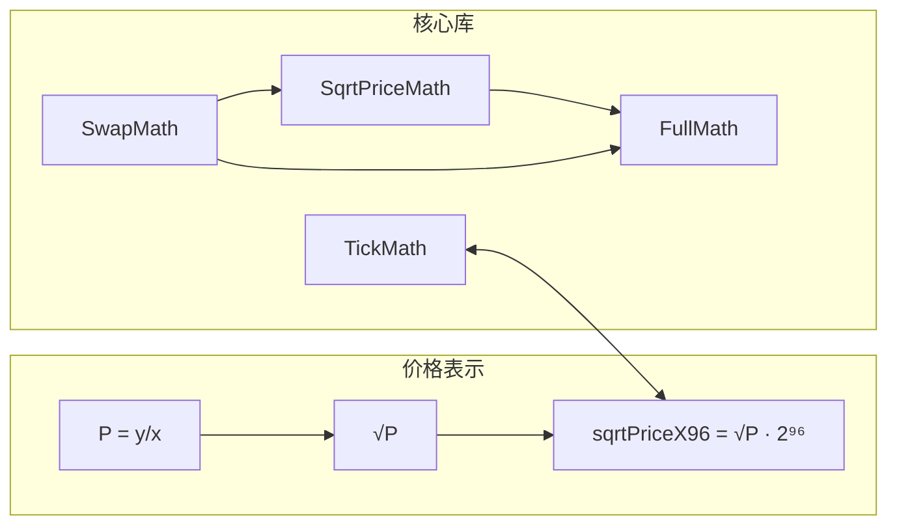

### 读前先记 4 个约定

- **链上存的不是 `P`，而是 `sqrt(P)`**：`sqrtPriceX96` 是 $\sqrt{P}$ 的 Q64.96 定点数，很多公式看起来“多了一层根号”，其实只是为了让乘除更稳定。
- **`zeroForOne` 可以直接理解成“价格往下走”**：因为它表示 `currency0 -> currency1`，而在 Uniswap 的坐标系里这对应 $\sqrt{P}$ 下降。
- **`SwapMath.computeSwapStep` 里 `amountRemaining < 0` 表示 exact in**：这是源码层一个很反直觉但很重要的编码约定，读流程图时别把正负号看反。
- **舍入方向不是实现细节，而是经济不变量**：`round up` / `round down` 的目标是“别越过目标价、别多给输出、别少收输入”，后面很多库都围绕这件事展开。

---

## `FixedPoint96.sol` / `FixedPoint128.sol`

**作用**：定点缩放常数，无计算逻辑。

| 库 | 常量 | 含义 |
|----|------|------|
| `FixedPoint96` | `Q96 = 2⁹⁶` | $\sqrt{P}$ 的小数部分用 96 位表示 |
| `FixedPoint128` | `Q128 = 2¹²⁸` | `TickMath` 中间量在 Q128.128 域运算 |

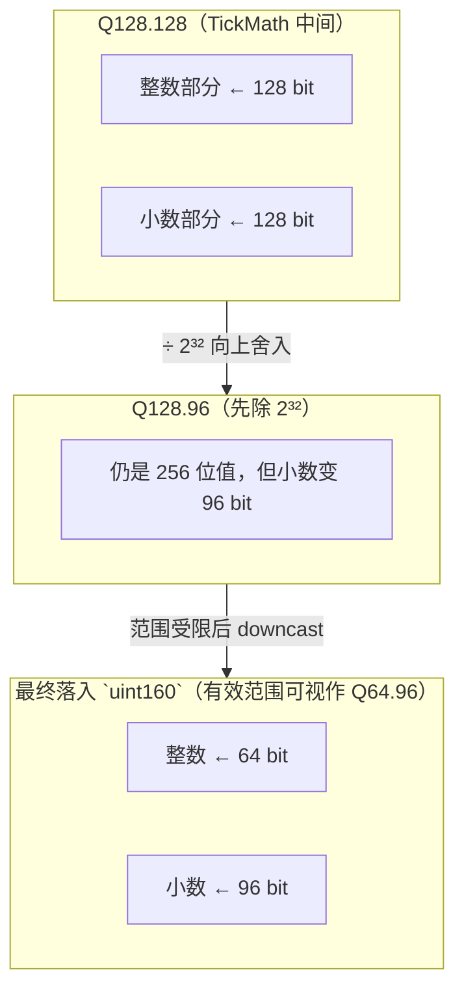

### 源码

```7:10:src/libraries/FixedPoint96.sol
library FixedPoint96 {
    uint8 internal constant RESOLUTION = 96;
    uint256 internal constant Q96 = 0x1000000000000000000000000;
}
```

```6:8:src/libraries/FixedPoint128.sol
library FixedPoint128 {
    uint256 internal constant Q128 = 0x100000000000000000000000000000000;
}
```

### 隐藏细节

- **更精确的转换顺序是 `Q128.128 -> Q128.96 -> uint160`**：源码先把 `price` 右移 32 位并向上舍入，再利用 tick 范围保证结果一定装得进 `uint160`；由于这个有效值域的整数部分最多 64 位，外部通常把最终存储值称作 **Q64.96**。
- **为何文档里写 Q128.128**：中间量 `price` 是「小数点对齐在正中间」的 256 位定点，每次 `* constant >> 128` 等价于乘一个有理因子后保留高位精度，与 Uniswap v3 同款常数链。

---

## `FullMath.sol`：512 位 `mulDiv` / `mulDivRoundingUp`

**问题**：`a * b` 可能溢出 256 位，但 $\lfloor ab/d \rfloor$ 本身仍在 `uint256` 内 —— **phantom overflow**。

**思路**（Remco Bloemen）：把 $a \cdot b$ 看成 512 位数 `[prod1 | prod0]`，在减去余数使整除后，对**奇数**分母用模 $2^{256}$ 的**乘法逆元**一次得到商。

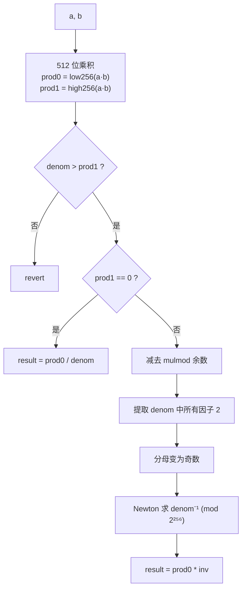

**`mulDivRoundingUp`**：先 `mulDiv`；若 `mulmod(a,b,d) ≠ 0` 则 `result++`。

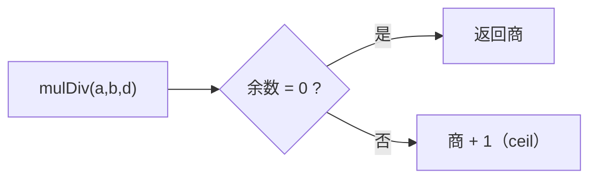

**ASCII：512 位乘积在寄存器中的布局（原理）**

```
  a · b 的完整乘积（最多 512 bit）
  ┌──────────────────────────┬──────────────────────────┐
  │         prod1            │          prod0           │
  │    高 256 bit（汇编恢复） │  a*b 的低 256 bit（直接乘）│
  └──────────────────────────┴──────────────────────────┘
                    再对 denominator 做精确除法 → uint256 商
```

### 源码（核心路径）

```14:100:src/libraries/FullMath.sol
    function mulDiv(uint256 a, uint256 b, uint256 denominator) internal pure returns (uint256 result) {
        unchecked {
            uint256 prod0 = a * b; // Least significant 256 bits of the product
            uint256 prod1; // Most significant 256 bits of the product
            assembly ("memory-safe") {
                let mm := mulmod(a, b, not(0))
                prod1 := sub(sub(mm, prod0), lt(mm, prod0))
            }

            // Make sure the result is less than 2**256.
            // Also prevents denominator == 0
            require(denominator > prod1);

            if (prod1 == 0) {
                assembly ("memory-safe") {
                    result := div(prod0, denominator)
                }
                return result;
            }

            uint256 remainder;
            assembly ("memory-safe") {
                remainder := mulmod(a, b, denominator)
            }
            assembly ("memory-safe") {
                prod1 := sub(prod1, gt(remainder, prod0))
                prod0 := sub(prod0, remainder)
            }

            uint256 twos = (0 - denominator) & denominator;
            assembly ("memory-safe") {
                denominator := div(denominator, twos)
            }
            assembly ("memory-safe") {
                prod0 := div(prod0, twos)
            }
            assembly ("memory-safe") {
                twos := add(div(sub(0, twos), twos), 1)
            }
            prod0 |= prod1 * twos;

            uint256 inv = (3 * denominator) ^ 2;
            inv *= 2 - denominator * inv;
            inv *= 2 - denominator * inv;
            inv *= 2 - denominator * inv;
            inv *= 2 - denominator * inv;
            inv *= 2 - denominator * inv;
            inv *= 2 - denominator * inv;
            result = prod0 * inv;
            return result;
        }
    }
```

```109:116:src/libraries/FullMath.sol
    function mulDivRoundingUp(uint256 a, uint256 b, uint256 denominator) internal pure returns (uint256 result) {
        unchecked {
            result = mulDiv(a, b, denominator);
            if (mulmod(a, b, denominator) != 0) {
                require(++result > 0);
            }
        }
    }
```

（中间「减余数、提 2 的幂、Newton 迭代求逆」见同一函数内完整实现。）

### 隐藏细节

- **`prod1` 的恢复式**：`mm = mulmod(a,b,not(0))` 即 $ab \bmod (2^{256}-1)$（因为 `not(0)` 是 $2^{256}-1$）。结合 `prod0 = ab mod 2^256`，用注释里的 **CRT（中国剩余定理）** 重构 512 位积；`prod1 := sub(sub(mm, prod0), lt(mm, prod0))` 正是在无进位信息下从低高位差借位。
- **`require(denominator > prod1)` 一箭双雕**：保证 $\lfloor ab/d\rfloor < 2^{256}$；同时当 `denominator == 0` 时，若 `prod1 == 0` 则 `0 > 0` 为假而 **revert**，避免除零（若 `prod1 > 0` 同样不满足不等式）。
- **`twos = (0 - denominator) & denominator`**：经典技巧，一次得到 `denominator` 的 **lowest set bit**（即整除分母的最大 $2^k$），便于把分母变成奇数以在模 $2^{256}$ 下可逆。
- **逆元迭代是“1 个种子 + 6 次 Newton”**：种子 `inv = (3 * denominator) ^ 2` 先给出 4 bit 正确度，随后 6 次迭代把正确 bit 数翻倍到 256 bit；文中若把它写成 7 次，就和当前源码不一致了。
- **`mulDivRoundingUp` 再算一次 `mulmod`**：与 `mulDiv` 内部已算过的余数信息重复，换取 **接口简单**；若手动内联可省一次 `mulmod`，但库选择清晰优先。
- **`require(++result > 0)`**：ceil 后若整除结果为 `type(uint256).max` 会回绕为 0，此处显式拒绝溢出。

---

## `UnsafeMath.sol`

在调用方已保证**不溢出、除数非零**时使用，省 gas。

- **`divRoundingUp`**：$\lceil x/y \rceil = \lfloor x/y \rfloor + [x \bmod y \neq 0]$
- **`simpleMulDiv`**：`div(mul(a,b), d)` — 中间积须已证安全

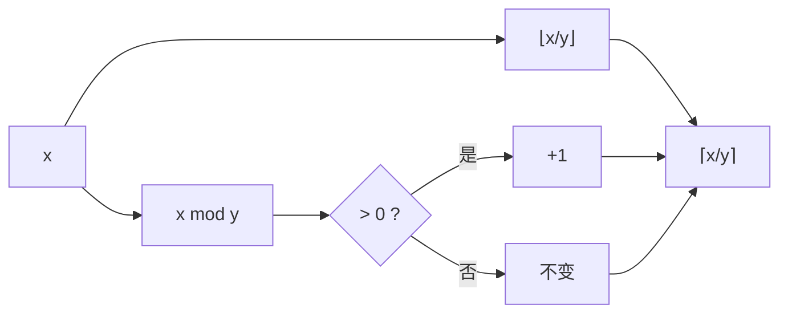

### 源码

```12:28:src/libraries/UnsafeMath.sol
    function divRoundingUp(uint256 x, uint256 y) internal pure returns (uint256 z) {
        assembly ("memory-safe") {
            z := add(div(x, y), gt(mod(x, y), 0))
        }
    }

    /// @notice Calculates floor(a×b÷denominator)
    /// @dev division by 0 will return 0, and should be checked externally
    /// @param a The multiplicand
    /// @param b The multiplier
    /// @param denominator The divisor
    /// @return result The 256-bit result, floor(a×b÷denominator)
    function simpleMulDiv(uint256 a, uint256 b, uint256 denominator) internal pure returns (uint256 result) {
        assembly ("memory-safe") {
            result := div(mul(a, b), denominator)
        }
    }
```

### 隐藏细节

- **`gt(mod(x,y),0)` 在 Yul 里就是 0/1**：与 `div` 相加实现 ceil，比 Solidity 分支更省 gas。
- **`y == 0`**：`div`/`mod` 在 EVM 里为 0，注释写明由调用方保证；误用会得到 `z = 0 + 1 = 1` 一类**无意义结果**，属于契约式安全。
- **`simpleMulDiv`**：故意不做 512 位；仅当分析证明 `a*b` 不溢出 256 位时可用（例如部分热路径上的界）。

---

## `SafeCast.sol`

窄化转换：**先 cast 再比对**，丢失高位或符号错误则 `revert`（配合 `CustomRevert`）。

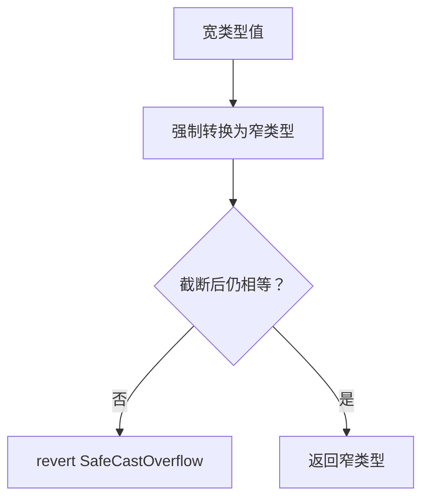

### 源码

```16:35:src/libraries/SafeCast.sol
    function toUint160(uint256 x) internal pure returns (uint160 y) {
        y = uint160(x);
        if (y != x) SafeCastOverflow.selector.revertWith();
    }

    /// @notice Cast a uint256 to a uint128, revert on overflow
    /// @param x The uint256 to be downcasted
    /// @return y The downcasted integer, now type uint128
    function toUint128(uint256 x) internal pure returns (uint128 y) {
        y = uint128(x);
        if (x != y) SafeCastOverflow.selector.revertWith();
    }

    /// @notice Cast a int128 to a uint128, revert on overflow or underflow
    /// @param x The int128 to be casted
    /// @return y The casted integer, now type uint128
    function toUint128(int128 x) internal pure returns (uint128 y) {
        if (x < 0) SafeCastOverflow.selector.revertWith();
        y = uint128(x);
    }
```

### 隐藏细节

- **`toUint160` 用 `y != x`、`toUint128(uint256)` 用 `x != y`**：对无符号窄化，两种写法等价于检查「高位是否全零」；`uint128` 版本把宽变量放左边是为与 **显式比较习惯** 一致（源码如此）。
- **与 `CustomRevert` 组合**：`bytes4.selector.revertWith()` 走自定义错误数据布局，便于在 **PoolManager** 一类合约里统一解析/包装 revert（见 `CustomRevert.sol`）。
- **`toInt256(uint256)`**：依赖「有符号顶位」：`int256(x)` 若超出 `int256` 正域会变成负数，用 `y < 0` 检测溢出。

---

## `BitMath.sol`：MSB / LSB

**`mostSignificantBit`**：二分比较 `x` 与阈值，缩小范围；最后用 **`byte` + 查找表** 定最低若干位的精确位置。

**`leastSignificantBit`**：`x & (-x)` **隔离最低位的 1**，再用 **特制常数 + 查表** 一次得到指数。

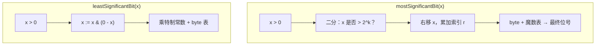

### 源码

```12:24:src/libraries/BitMath.sol
    function mostSignificantBit(uint256 x) internal pure returns (uint8 r) {
        require(x > 0);

        assembly ("memory-safe") {
            r := shl(7, lt(0xffffffffffffffffffffffffffffffff, x))
            r := or(r, shl(6, lt(0xffffffffffffffff, shr(r, x))))
            r := or(r, shl(5, lt(0xffffffff, shr(r, x))))
            r := or(r, shl(4, lt(0xffff, shr(r, x))))
            r := or(r, shl(3, lt(0xff, shr(r, x))))
            // forgefmt: disable-next-item
            r := or(r, byte(and(0x1f, shr(shr(r, x), 0x8421084210842108cc6318c6db6d54be)),
                0x0706060506020500060203020504000106050205030304010505030400000000))
        }
    }
```

```31:47:src/libraries/BitMath.sol
    function leastSignificantBit(uint256 x) internal pure returns (uint8 r) {
        require(x > 0);

        assembly ("memory-safe") {
            // Isolate the least significant bit.
            x := and(x, sub(0, x))
            // For the upper 3 bits of the result, use a De Bruijn-like lookup.
            // Credit to adhusson: https://blog.adhusson.com/cheap-find-first-set-evm/
            // forgefmt: disable-next-item
            r := shl(5, shr(252, shl(shl(2, shr(250, mul(x,
                0xb6db6db6ddddddddd34d34d349249249210842108c6318c639ce739cffffffff))),
                0x8040405543005266443200005020610674053026020000107506200176117077)))
            // For the lower 5 bits of the result, use a De Bruijn lookup.
            // forgefmt: disable-next-item
            r := or(r, byte(and(div(0xd76453e0, shr(r, x)), 0x1f),
                0x001f0d1e100c1d070f090b19131c1706010e11080a1a141802121b1503160405))
        }
    }
```

### 隐藏细节

- **`lt(A, B)` 在汇编里是 0/1**：直接 `shl(7, ...)` 等把比较结果当成 **无分支** 的位移量累加到 `r`，避免 Solidity `if`。
- **MSB 最后一步**：`shr(r, x)` 把 `x` 缩到 ≤31 位有效，再用 **魔数 + `byte` 表查** 把最后几位补齐；这里最值得强调的是“无分支查表”，不必把它强行理解成经典 De Bruijn 教材写法。
- **LSB 分两表**：高 3 位与低 5 位拆开查（adhusson / Solady 路线），用两次 `byte` 拼出完整 0–255 索引。
- **`require(x > 0)`**：与 `TickBitmap` / `TickMath` 调用约定一致；对 0 输入未定义，防止查表越界或死循环语义。

---

## `TickMath.sol`

### `getSqrtPriceAtTick`

1. **`absTick`**：汇编无分支绝对值（依赖 MIN/MAX_TICK 关于 0 对称）。
2. **按位乘常数**：$|t| = \sum b_i 2^i$ ⇒ $\sqrt{1.0001^{|t|}} = \prod_i (\sqrt{1.0001^{2^i}})^{b_i}$，每个因子是预计算的 **Q128.128** 常数。
3. **`tick > 0`**：对 price 取倒数（$\sqrt{P}$ 随 tick 正负对称处理）。
4. **先从 Q128.128 落到 Q128.96，再 downcast 到 `uint160`**：右移 $2^{32}$ 时**向上舍入**，最终存成我们平时说的 `sqrtPriceX96`（有效值域可视作 Q64.96）。

**ASCII：|tick| 按位累乘（原理）**

```
  |tick| = … b₄ b₃ b₂ b₁ b₀   （二进制）

  price 初值对应 b₀ 是否为 1（源码用 xor/mul 无分支选常数）
  for 每个更高位 i：
    if bᵢ = 1 :  price ← (price * TABLE[i]) >> 128

  tick > 0  →  price ← (2²⁵⁶−1) / price   （源码是 div(not(0), price)）
  最后       →  先 ceil(price / 2³²)，再 downcast 到 uint160
```

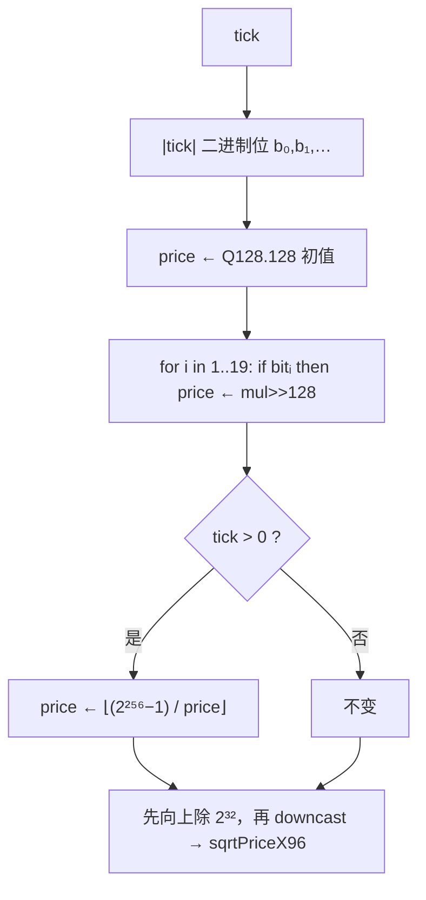

### `getTickAtSqrtPrice`

在 `price = sqrtX96 << 32` 上算 **$\log_2$**（`BitMath.mostSignificantBit` + 反复 `r²` 取高位），再换底到 $\log_{\sqrt{1.0001}}$，用**误差界**得到 `tickLow` / `tickHi`，必要时用 `getSqrtPriceAtTick` 二次判定。

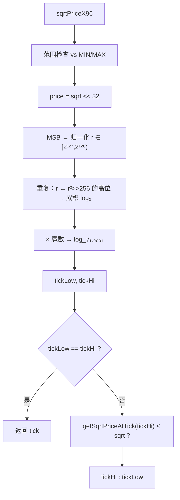

### 源码

`getSqrtPriceAtTick`：绝对值、按位乘、倒数，再 **向上舍入除以 `2^32`** 并 downcast 到 `uint160`。

```57:114:src/libraries/TickMath.sol
    function getSqrtPriceAtTick(int24 tick) internal pure returns (uint160 sqrtPriceX96) {
        unchecked {
            uint256 absTick;
            assembly ("memory-safe") {
                tick := signextend(2, tick)
                let mask := sar(255, tick)
                absTick := xor(mask, add(mask, tick))
            }

            if (absTick > uint256(int256(MAX_TICK))) InvalidTick.selector.revertWith(tick);

            uint256 price;
            assembly ("memory-safe") {
                price := xor(shl(128, 1), mul(xor(shl(128, 1), 0xfffcb933bd6fad37aa2d162d1a594001), and(absTick, 0x1)))
            }
            if (absTick & 0x2 != 0) price = (price * 0xfff97272373d413259a46990580e213a) >> 128;
            if (absTick & 0x4 != 0) price = (price * 0xfff2e50f5f656932ef12357cf3c7fdcc) >> 128;
            if (absTick & 0x8 != 0) price = (price * 0xffe5caca7e10e4e61c3624eaa0941cd0) >> 128;
            if (absTick & 0x10 != 0) price = (price * 0xffcb9843d60f6159c9db58835c926644) >> 128;
            if (absTick & 0x20 != 0) price = (price * 0xff973b41fa98c081472e6896dfb254c0) >> 128;
            if (absTick & 0x40 != 0) price = (price * 0xff2ea16466c96a3843ec78b326b52861) >> 128;
            if (absTick & 0x80 != 0) price = (price * 0xfe5dee046a99a2a811c461f1969c3053) >> 128;
            if (absTick & 0x100 != 0) price = (price * 0xfcbe86c7900a88aedcffc83b479aa3a4) >> 128;
            if (absTick & 0x200 != 0) price = (price * 0xf987a7253ac413176f2b074cf7815e54) >> 128;
            if (absTick & 0x400 != 0) price = (price * 0xf3392b0822b70005940c7a398e4b70f3) >> 128;
            if (absTick & 0x800 != 0) price = (price * 0xe7159475a2c29b7443b29c7fa6e889d9) >> 128;
            if (absTick & 0x1000 != 0) price = (price * 0xd097f3bdfd2022b8845ad8f792aa5825) >> 128;
            if (absTick & 0x2000 != 0) price = (price * 0xa9f746462d870fdf8a65dc1f90e061e5) >> 128;
            if (absTick & 0x4000 != 0) price = (price * 0x70d869a156d2a1b890bb3df62baf32f7) >> 128;
            if (absTick & 0x8000 != 0) price = (price * 0x31be135f97d08fd981231505542fcfa6) >> 128;
            if (absTick & 0x10000 != 0) price = (price * 0x9aa508b5b7a84e1c677de54f3e99bc9) >> 128;
            if (absTick & 0x20000 != 0) price = (price * 0x5d6af8dedb81196699c329225ee604) >> 128;
            if (absTick & 0x40000 != 0) price = (price * 0x2216e584f5fa1ea926041bedfe98) >> 128;
            if (absTick & 0x80000 != 0) price = (price * 0x48a170391f7dc42444e8fa2) >> 128;

            assembly ("memory-safe") {
                if sgt(tick, 0) { price := div(not(0), price) }
                sqrtPriceX96 := shr(32, add(price, sub(shl(32, 1), 1)))
            }
        }
    }
```

`getTickAtSqrtPrice`：单条比较做范围检查 + `log_2` 迭代 + 魔数误差界 + 必要时二次比较。**第 2～14 段**汇编与下述第 1 段同形（`shl(63,f)` … `shl(50,f)`），见 `147:223:src/libraries/TickMath.sol`。

```121:146:src/libraries/TickMath.sol
    function getTickAtSqrtPrice(uint160 sqrtPriceX96) internal pure returns (int24 tick) {
        unchecked {
            if ((sqrtPriceX96 - MIN_SQRT_PRICE) > MAX_SQRT_PRICE_MINUS_MIN_SQRT_PRICE_MINUS_ONE) {
                InvalidSqrtPrice.selector.revertWith(sqrtPriceX96);
            }

            uint256 price = uint256(sqrtPriceX96) << 32;

            uint256 r = price;
            uint256 msb = BitMath.mostSignificantBit(r);

            if (msb >= 128) r = price >> (msb - 127);
            else r = price << (127 - msb);

            int256 log_2 = (int256(msb) - 128) << 64;

            assembly ("memory-safe") {
                r := shr(127, mul(r, r))
                let f := shr(128, r)
                log_2 := or(log_2, shl(63, f))
                r := shr(f, r)
            }
```

```225:237:src/libraries/TickMath.sol
            int256 log_sqrt10001 = log_2 * 255738958999603826347141; // Q22.128 number

            // Magic number represents the ceiling of the maximum value of the error when approximating log_sqrt10001(x)
            int24 tickLow = int24((log_sqrt10001 - 3402992956809132418596140100660247210) >> 128);

            // Magic number represents the minimum value of the error when approximating log_sqrt10001(x), when
            // sqrtPrice is from the range (2^-64, 2^64). This is safe as MIN_SQRT_PRICE is more than 2^-64. If MIN_SQRT_PRICE
            // is changed, this may need to be changed too
            int24 tickHi = int24((log_sqrt10001 + 291339464771989622907027621153398088495) >> 128);

            tick = tickLow == tickHi ? tickLow : getSqrtPriceAtTick(tickHi) <= sqrtPriceX96 ? tickHi : tickLow;
        }
    }
```

### 隐藏细节

- **`absTick` 与注释中的前提**：`@dev` 写明若 MIN/MAX_TICK **不关于 0 对称**，这段无分支 `absTick` 公式 **不可再用**；当前常数满足对称，故可省分支。
- **首项 `price` 的汇编**：`xor(shl(128,1), mul(xor(...), and(absTick,0x1)))` 在 **无 if** 情况下根据 bit0 选 `1<<128` 或 `2^128/√1.0001` 的整数近似，减少 cold jump。
- **`tick > 0` 用 `div(not(0), price)`**：即 $\lfloor (2^{256}-1)/price \rfloor$，与「真数学倒数」差最多 1 ulp 量级；之后源码是先把 Q128.128 **向上舍入到 Q128.96**，再依赖范围约束安全 downcast 到 `uint160`。
- **范围检查一条减法**：`sqrt - MIN > MAX-MIN-1` 同时覆盖 `sqrt < MIN`（下溢变大数）与 `sqrt >= MAX`（注释强调 **必须 ≥** 而非 >，因为 max tick 对应价不可取到）。
- **`getTickAtSqrtPrice` 的魔数**：`tickLow`/`tickHi` 来自对 $\log_{\sqrt{1.0001}}$ 近似误差的 **保守区间**；`tickHi` 魔数注释写明依赖 `MIN_SQRT_PRICE > 2^-64`，**改 MIN_SQRT_PRICE 可能要重调常数**。
- **重复 14 段 `assembly`**：每段给 `log_2` 再抠一位二进制小数；未压成循环是 **历史 + 编译期展开 gas** 权衡（与 v3 一致风格）。
- **最终 `tick` 选择**：保证返回的是满足 `getSqrtPriceAtTick(tick) ≤ sqrtPriceX96` 的 **最大** tick，与「向下取整到 tick 栅格」语义一致。

---

## `SqrtPriceMath.sol`

### 舍入与 swap 安全侧

- **currency0 推动价格**：下一根 $\sqrt{P}$ **向上取整**。
- **currency1 推动价格**：**向下取整**。

别把这两条看成“数学上的任性选择”。它们服务的是 swap 语义：

- **exact in**：不要因为舍入把输出给多了。
- **exact out**：不要因为舍入导致价格走得还不够，最后拿不到承诺输出。

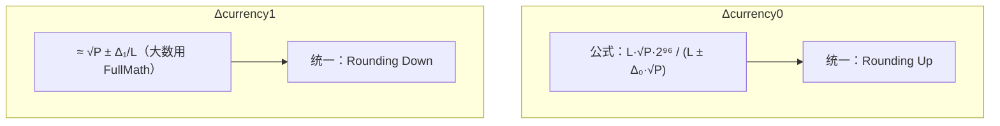

### `getAmount1Delta` 的舍入优化

先 `FullMath.mulDiv(L, |Δ√P|, Q96)`，再用 **`mulmod` + 汇编** 在 `roundUp` 时加 1，避免再调 `mulDivRoundingUp`。

### 源码

`amount0` 下一价：主路径 + overflow fallback + `remove` 的汇编校验。

```31:74:src/libraries/SqrtPriceMath.sol
    function getNextSqrtPriceFromAmount0RoundingUp(uint160 sqrtPX96, uint128 liquidity, uint256 amount, bool add)
        internal
        pure
        returns (uint160)
    {
        if (amount == 0) return sqrtPX96;
        uint256 numerator1 = uint256(liquidity) << FixedPoint96.RESOLUTION;

        if (add) {
            unchecked {
                uint256 product = amount * sqrtPX96;
                if (product / amount == sqrtPX96) {
                    uint256 denominator = numerator1 + product;
                    if (denominator >= numerator1) {
                        return uint160(FullMath.mulDivRoundingUp(numerator1, sqrtPX96, denominator));
                    }
                }
            }
            return uint160(UnsafeMath.divRoundingUp(numerator1, (numerator1 / sqrtPX96) + amount));
        } else {
            unchecked {
                uint256 product = amount * sqrtPX96;
                assembly ("memory-safe") {
                    if iszero(
                        and(
                            eq(div(product, amount), and(sqrtPX96, 0xffffffffffffffffffffffffffffffffffffffff)),
                            gt(numerator1, product)
                        )
                    ) {
                        mstore(0, 0xf5c787f1)
                        revert(0x1c, 0x04)
                    }
                }
                uint256 denominator = numerator1 - product;
                return FullMath.mulDivRoundingUp(numerator1, sqrtPX96, denominator).toUint160();
            }
        }
    }
```

`amount1` 下一价：小额走位移除法，大额 `FullMath`；`getAmount1Delta` 用 `mulmod` 做 ceil。

```86:118:src/libraries/SqrtPriceMath.sol
    function getNextSqrtPriceFromAmount1RoundingDown(uint160 sqrtPX96, uint128 liquidity, uint256 amount, bool add)
        internal
        pure
        returns (uint160)
    {
        if (add) {
            uint256 quotient = (
                amount <= type(uint160).max
                    ? (amount << FixedPoint96.RESOLUTION) / liquidity
                    : FullMath.mulDiv(amount, FixedPoint96.Q96, liquidity)
            );

            return (uint256(sqrtPX96) + quotient).toUint160();
        } else {
            uint256 quotient = (
                amount <= type(uint160).max
                    ? UnsafeMath.divRoundingUp(amount << FixedPoint96.RESOLUTION, liquidity)
                    : FullMath.mulDivRoundingUp(amount, FixedPoint96.Q96, liquidity)
            );

            assembly ("memory-safe") {
                if iszero(gt(and(sqrtPX96, 0xffffffffffffffffffffffffffffffffffffffff), quotient)) {
                    mstore(0, 0x4323a555)
                    revert(0x1c, 0x04)
                }
            }
            unchecked {
                return uint160(sqrtPX96 - quotient);
            }
        }
    }
```

```234:254:src/libraries/SqrtPriceMath.sol
    function getAmount1Delta(uint160 sqrtPriceAX96, uint160 sqrtPriceBX96, uint128 liquidity, bool roundUp)
        internal
        pure
        returns (uint256 amount1)
    {
        uint256 numerator = absDiff(sqrtPriceAX96, sqrtPriceBX96);
        uint256 denominator = FixedPoint96.Q96;
        uint256 _liquidity = uint256(liquidity);

        amount1 = FullMath.mulDiv(_liquidity, numerator, denominator);
        assembly ("memory-safe") {
            amount1 := add(amount1, and(gt(mulmod(_liquidity, numerator, denominator), 0), roundUp))
        }
    }
```

### 隐藏细节

- **`amount == 0` 早退**：注释写明否则 **结果不一定等于输入价**（舍入路径不同会导致「零输入却改价」类数值噪声）。
- **`product / amount == sqrtPX96`**：检测 `amount * sqrtPX96` **未溢出**；失败则走 `L/(L/sqrt + amount)` 等价式，避免 phantom overflow。
- **`denominator >= numerator1`（add 分支）**：在 overflow 边缘防止 `numerator1 + product` 绕回导致 **错误接受** 主公式路径。
- **remove amount0 的汇编条件**：`eq(div(product,amount), and(sqrtPX96, mask))` 同时验证乘积未歪曲 `sqrtPX96` 且 `numerator1 > product`；`revert(0x1c,0x04)` 只抛 **4 字节 selector**，省 data gas。
- **Input/Output 路由**：`getNextSqrtPriceFromInput` 在 **zeroForOne** 时用 amount0 **加**（rounding up）与 amount1 **加**（rounding down），保证「不会越过目标价」；`Output` 则相反组合（见 145–177 行注释 *pass the target*）。
- **`getAmount0Delta` 的 `roundUp` 分支**：连续两次向上（`mulDivRoundingUp` 再 `divRoundingUp`）对应公式里 **双重除法** 的保守侧。
- **有符号重载**：流动性为负时用 `false` 舍入、为正用 `true` 再取负，对应 **移除/添加** 流动性的经济方向（注释与 v3 一致）。
- **`and(..., roundUp)`**：`roundUp` 是 bool，在 Yul 里是 0/1，与 `gt(mulmod,0)` 相与后 **仅一位** 加在 amount1 上 — 等价 `mulDivRoundingUp` 但少一次完整 `mulDiv` 调用。

---

## `SwapMath.sol`

### `getSqrtPriceTarget`

用汇编在「下一 tick 价」与「用户限价」之间选 **max**（zeroForOne）或 **min**，无分支切换变量。

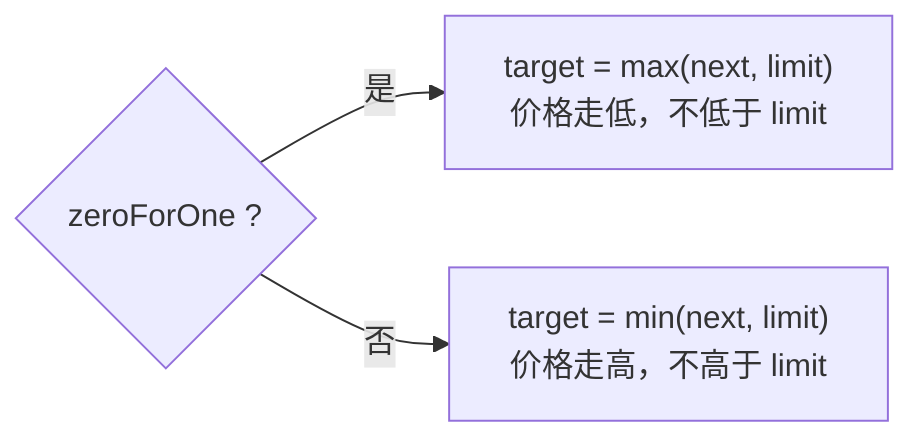

### `computeSwapStep`

- 这里有个容易读反的约定：**`amountRemaining < 0` 表示 exact in，`amountRemaining >= 0` 表示 exact out**。
- **Exact in**：先把剩余量换成**扣 LP 费后可当输入用的量** `mulDiv(remain, 1e6−fee, 1e6)`，再与打到目标价所需输入比较。
- **Exact out**：先按目标价算输出上限，超过则按剩余输出反推 `getNextSqrtPriceFromOutput`；费用对输入做 `mulDivRoundingUp`。

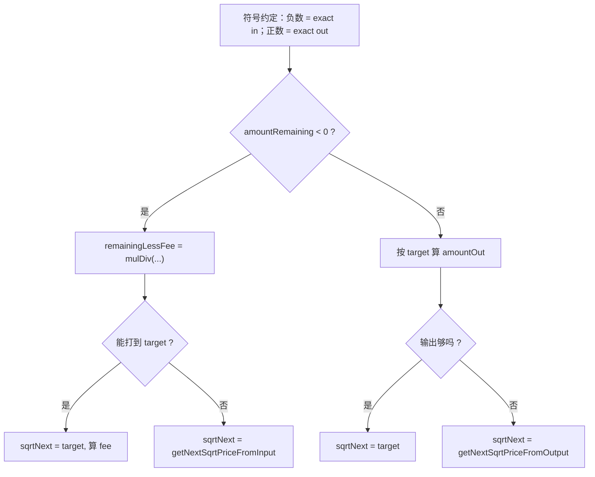

### 源码

```20:37:src/libraries/SwapMath.sol
    function getSqrtPriceTarget(bool zeroForOne, uint160 sqrtPriceNextX96, uint160 sqrtPriceLimitX96)
        internal
        pure
        returns (uint160 sqrtPriceTargetX96)
    {
        assembly ("memory-safe") {
            sqrtPriceNextX96 := and(sqrtPriceNextX96, 0xffffffffffffffffffffffffffffffffffffffff)
            sqrtPriceLimitX96 := and(sqrtPriceLimitX96, 0xffffffffffffffffffffffffffffffffffffffff)
            let nextOrLimit := xor(lt(sqrtPriceNextX96, sqrtPriceLimitX96), and(zeroForOne, 0x1))
            let symDiff := xor(sqrtPriceNextX96, sqrtPriceLimitX96)
            sqrtPriceTargetX96 := xor(sqrtPriceLimitX96, mul(symDiff, nextOrLimit))
        }
    }
```

```51:106:src/libraries/SwapMath.sol
    function computeSwapStep(
        uint160 sqrtPriceCurrentX96,
        uint160 sqrtPriceTargetX96,
        uint128 liquidity,
        int256 amountRemaining,
        uint24 feePips
    ) internal pure returns (uint160 sqrtPriceNextX96, uint256 amountIn, uint256 amountOut, uint256 feeAmount) {
        unchecked {
            uint256 _feePips = feePips;
            bool zeroForOne = sqrtPriceCurrentX96 >= sqrtPriceTargetX96;
            bool exactIn = amountRemaining < 0;

            if (exactIn) {
                uint256 amountRemainingLessFee =
                    FullMath.mulDiv(uint256(-amountRemaining), MAX_SWAP_FEE - _feePips, MAX_SWAP_FEE);
                amountIn = zeroForOne
                    ? SqrtPriceMath.getAmount0Delta(sqrtPriceTargetX96, sqrtPriceCurrentX96, liquidity, true)
                    : SqrtPriceMath.getAmount1Delta(sqrtPriceCurrentX96, sqrtPriceTargetX96, liquidity, true);
                if (amountRemainingLessFee >= amountIn) {
                    sqrtPriceNextX96 = sqrtPriceTargetX96;
                    feeAmount = _feePips == MAX_SWAP_FEE
                        ? amountIn
                        : FullMath.mulDivRoundingUp(amountIn, _feePips, MAX_SWAP_FEE - _feePips);
                } else {
                    amountIn = amountRemainingLessFee;
                    sqrtPriceNextX96 = SqrtPriceMath.getNextSqrtPriceFromInput(
                        sqrtPriceCurrentX96, liquidity, amountRemainingLessFee, zeroForOne
                    );
                    feeAmount = uint256(-amountRemaining) - amountIn;
                }
                amountOut = zeroForOne
                    ? SqrtPriceMath.getAmount1Delta(sqrtPriceNextX96, sqrtPriceCurrentX96, liquidity, false)
                    : SqrtPriceMath.getAmount0Delta(sqrtPriceCurrentX96, sqrtPriceNextX96, liquidity, false);
            } else {
                amountOut = zeroForOne
                    ? SqrtPriceMath.getAmount1Delta(sqrtPriceTargetX96, sqrtPriceCurrentX96, liquidity, false)
                    : SqrtPriceMath.getAmount0Delta(sqrtPriceCurrentX96, sqrtPriceTargetX96, liquidity, false);
                if (uint256(amountRemaining) >= amountOut) {
                    sqrtPriceNextX96 = sqrtPriceTargetX96;
                } else {
                    amountOut = uint256(amountRemaining);
                    sqrtPriceNextX96 =
                        SqrtPriceMath.getNextSqrtPriceFromOutput(sqrtPriceCurrentX96, liquidity, amountOut, zeroForOne);
                }
                amountIn = zeroForOne
                    ? SqrtPriceMath.getAmount0Delta(sqrtPriceNextX96, sqrtPriceCurrentX96, liquidity, true)
                    : SqrtPriceMath.getAmount1Delta(sqrtPriceCurrentX96, sqrtPriceNextX96, liquidity, true);
                feeAmount = FullMath.mulDivRoundingUp(amountIn, _feePips, MAX_SWAP_FEE - _feePips);
            }
        }
    }
```

### 隐藏细节

- **`and(..., 0xff...ff)`**：对理论上的 `uint160` 参数再 **清高位**，防止调用方错误地把脏高位传入汇编，影响 `lt` / `xor`。
- **`nextOrLimit := xor(lt(next, limit), zeroForOne)`**：真值表实现 **zeroForOne ? max : min**，全程无 `if`。
- **`zeroForOne` 由当前价与目标价比较推出**：`current >= target` 等价于 **向低价方向走**（currency0→currency1），与 `SqrtPriceMath` 参数顺序固定搭配；读代码时务必 **对照曲线方向**。
- **Exact in 的 `amountRemainingLessFee`**：先把用户标量里的 **总输入** 换成「扣掉 LP 费后、能进 AMM 公式的输入」，分母用 `MAX_SWAP_FEE`；协议费若在更外层已合成进 `feePips`，这里看到的是 **总费率**。
- **打在目标价时的 `feeAmount`**：`mulDivRoundingUp(amountIn, fee, 1e6-fee)` 是 **先从净输入反推毛费用** 的向上取整，与未打满目标时 `fee = |remaining| - amountIn` **两条逻辑**并存。
- **`_feePips == MAX_SWAP_FEE` 分支**：100% LP 费时 `amountRemainingLessFee` 为 0，能打到目标则 `amountIn` 必为 0，注释说明此时 `feeAmount = amountIn` 为 **占位一致**；实际业务上该分支极少出现。
- **Exact out 末尾**：注释写 **`feePips` 不能为 `MAX_SWAP_FEE`**，否则分母 `1e6-fee` 为 0；由上层 **LPFeeLibrary** 与 swap 路径保证。

---

## `LiquidityMath.sol`：`addDelta`

汇编：`z = uint128(x) + signextend(int128(y))`，若 `z >> 128 != 0` 则溢出，**一次检查**覆盖加/减双向。

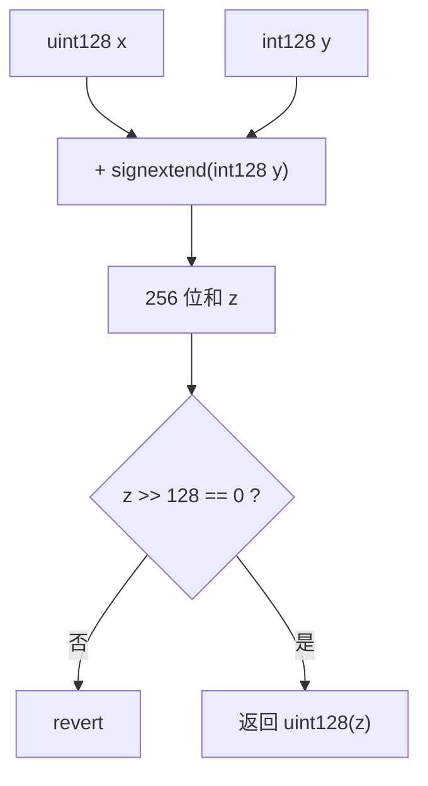

### 源码

```10:19:src/libraries/LiquidityMath.sol
    function addDelta(uint128 x, int128 y) internal pure returns (uint128 z) {
        assembly ("memory-safe") {
            z := add(and(x, 0xffffffffffffffffffffffffffffffff), signextend(15, y))
            if shr(128, z) {
                // revert SafeCastOverflow()
                mstore(0, 0x93dafdf1)
                revert(0x1c, 0x04)
            }
        }
    }
```

### 隐藏细节

- **`signextend(15, y)`**：把 `int128` 的符号正确扩展到 256 位再与 `x` 相加，**负数 delta** 走同一加法器。
- **`shr(128, z)` 判溢出**：若结果真在 `uint128` 合法范围，则加法结果的高 128 位应为 0；任一为 1 即 **上溢或下溢成负**（在 uint 语义下表现为巨大正数）—— 统一拒绝。
- **revert 用 `SafeCastOverflow()` 的 selector `0x93dafdf1`**：与 `SafeCast.sol` 里 `error SafeCastOverflow()` **同一 4 字节**（`cast sig "SafeCastOverflow()"` 可验证）；此处为 **汇编直抛**，`SafeCast` 为 **`CustomRevert`**，实现路径不同但链上解码一致。

---

## `LPFeeLibrary.sol`

费率以 **pips**（$10^{-6}$）为单位；**最高位**表示动态费池；**次高位**表示 hook 覆盖本次 swap 费率等。`isValid` 保证 `fee ≤ 10⁶`。

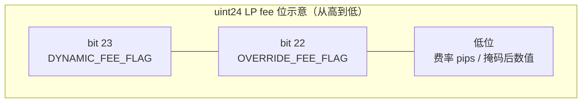

（具体语义与掩码以源码 `DYNAMIC_FEE_FLAG`、`OVERRIDE_FEE_FLAG`、`REMOVE_OVERRIDE_MASK` 为准。）

### 源码

```14:78:src/libraries/LPFeeLibrary.sol
    uint24 public constant DYNAMIC_FEE_FLAG = 0x800000;

    uint24 public constant OVERRIDE_FEE_FLAG = 0x400000;

    uint24 public constant REMOVE_OVERRIDE_MASK = 0xBFFFFF;

    uint24 public constant MAX_LP_FEE = 1000000;

    function isDynamicFee(uint24 self) internal pure returns (bool) {
        return self == DYNAMIC_FEE_FLAG;
    }

    function isValid(uint24 self) internal pure returns (bool) {
        return self <= MAX_LP_FEE;
    }

    function validate(uint24 self) internal pure {
        if (!self.isValid()) LPFeeTooLarge.selector.revertWith(self);
    }

    function getInitialLPFee(uint24 self) internal pure returns (uint24) {
        if (self.isDynamicFee()) return 0;
        self.validate();
        return self;
    }

    function isOverride(uint24 self) internal pure returns (bool) {
        return self & OVERRIDE_FEE_FLAG != 0;
    }

    function removeOverrideFlag(uint24 self) internal pure returns (uint24) {
        return self & REMOVE_OVERRIDE_MASK;
    }

    function removeOverrideFlagAndValidate(uint24 self) internal pure returns (uint24 fee) {
        fee = self.removeOverrideFlag();
        fee.validate();
    }
```

### 隐藏细节

- **`DYNAMIC_FEE_FLAG` 是「精确等于」**：只有 **整字** `0x800000` 表示动态池，而不是「测最高位」；因此 **不能** 把 `0x800001` 当成动态+费率，设计上用 **独特点位** 与合法 pips 错开。
- **动态池初始 LP 费为 0**：注释说明若 hook 要非零初值，应在 **`afterInitialize` 里 `updateDynamicLPFee`**，避免与静态费率语义混淆。
- **`OVERRIDE_FEE_FLAG` 与 `REMOVE_OVERRIDE_MASK`**：`0xBFFFFF = ~0x400000 & 0xFFFFFF`，去掉次高位后再 `validate`，防止 hook 返回带标志的 **超界费率**。

---

## `ProtocolFeeLibrary.sol`

- **打包**：低 12 位 = zeroForOne 协议费，高 12 位 = oneForZero 协议费。
- **`calculateSwapFee`**：合成总 swap 费（先协议、再 LP 的叠加效果）：

$$\text{swapFee} = p + \ell - \lfloor p \cdot \ell / 10^6 \rfloor$$

（实现中为汇编 `add` + `sub` + `div(mul(p,l), 1e6)`。）

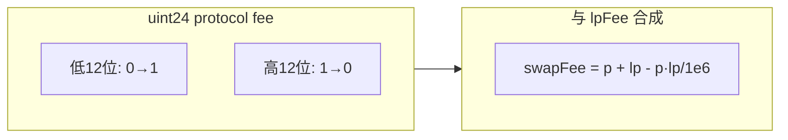

### 源码

```5:46:src/libraries/ProtocolFeeLibrary.sol
library ProtocolFeeLibrary {
    uint16 public constant MAX_PROTOCOL_FEE = 1000;

    uint24 internal constant FEE_0_THRESHOLD = 1001;
    uint24 internal constant FEE_1_THRESHOLD = 1001 << 12;

    uint256 internal constant PIPS_DENOMINATOR = 1_000_000;

    function getZeroForOneFee(uint24 self) internal pure returns (uint16) {
        return uint16(self & 0xfff);
    }

    function getOneForZeroFee(uint24 self) internal pure returns (uint16) {
        return uint16(self >> 12);
    }

    function isValidProtocolFee(uint24 self) internal pure returns (bool valid) {
        assembly ("memory-safe") {
            let isZeroForOneFeeOk := lt(and(self, 0xfff), FEE_0_THRESHOLD)
            let isOneForZeroFeeOk := lt(and(self, 0xfff000), FEE_1_THRESHOLD)
            valid := and(isZeroForOneFeeOk, isOneForZeroFeeOk)
        }
    }

    function calculateSwapFee(uint16 self, uint24 lpFee) internal pure returns (uint24 swapFee) {
        assembly ("memory-safe") {
            self := and(self, 0xfff)
            lpFee := and(lpFee, 0xffffff)
            let numerator := mul(self, lpFee)
            swapFee := sub(add(self, lpFee), div(numerator, PIPS_DENOMINATOR))
        }
    }
}
```

### 隐藏细节

- **`isValidProtocolFee` 用 `lt` 与阈值 1001**：低 12 位必须 `< 1001` 即 `≤ 1000`；高 12 位用 `and(self, 0xfff000) < (1001<<12)`，等价于 **右移后 ≤ 1000**，且 **一次汇编** 读两个方向，避免两次函数调用。
- **`calculateSwapFee` 的公式**：`swapFee = p + lp - floor(p*lp/1e6)`，对应「先按协议费扣，再对剩余收 LP 费」的 **有效总费率**（与注释中 `protocolFee + lpFee(1e6-protocolFee)/1e6` 的展开一致）；这里用 **向下取整** 的乘积项，与 Pool 内其它舍入配合。
- **`MAX_PROTOCOL_FEE` 注释**：提高上限可能导致 **`Pool.swap` 内溢出**（与中间量宽度有关），属 **协议级不变量**，非随意常数。

---

## `TickBitmap.sol`

- **`compress`**：`tick / tickSpacing` 向 $-\infty$ 取整（负数非整除时多减 1）。
- **`position`**：`wordPos = compressed >> 8`，`bitPos = compressed & 0xff` — 每槽 256 位。
- **`nextInitializedTickWithinOneWord`**：用掩码与 `BitMath.mostSignificantBit` / `leastSignificantBit` 在**一个字**内找下一个已初始化 tick。

读这里时建议先固定一个视觉约定：**bit 0 在最右边，bit 255 在最左边**。后面说“低位侧 / 高位侧”时，都是按这个方向描述。

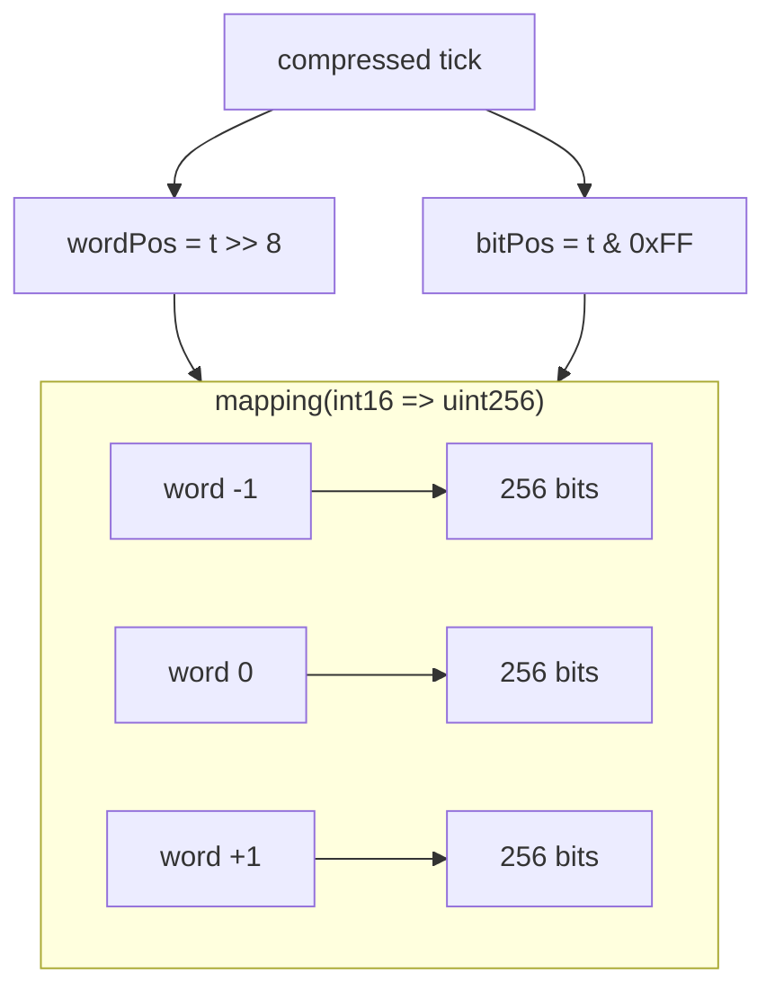

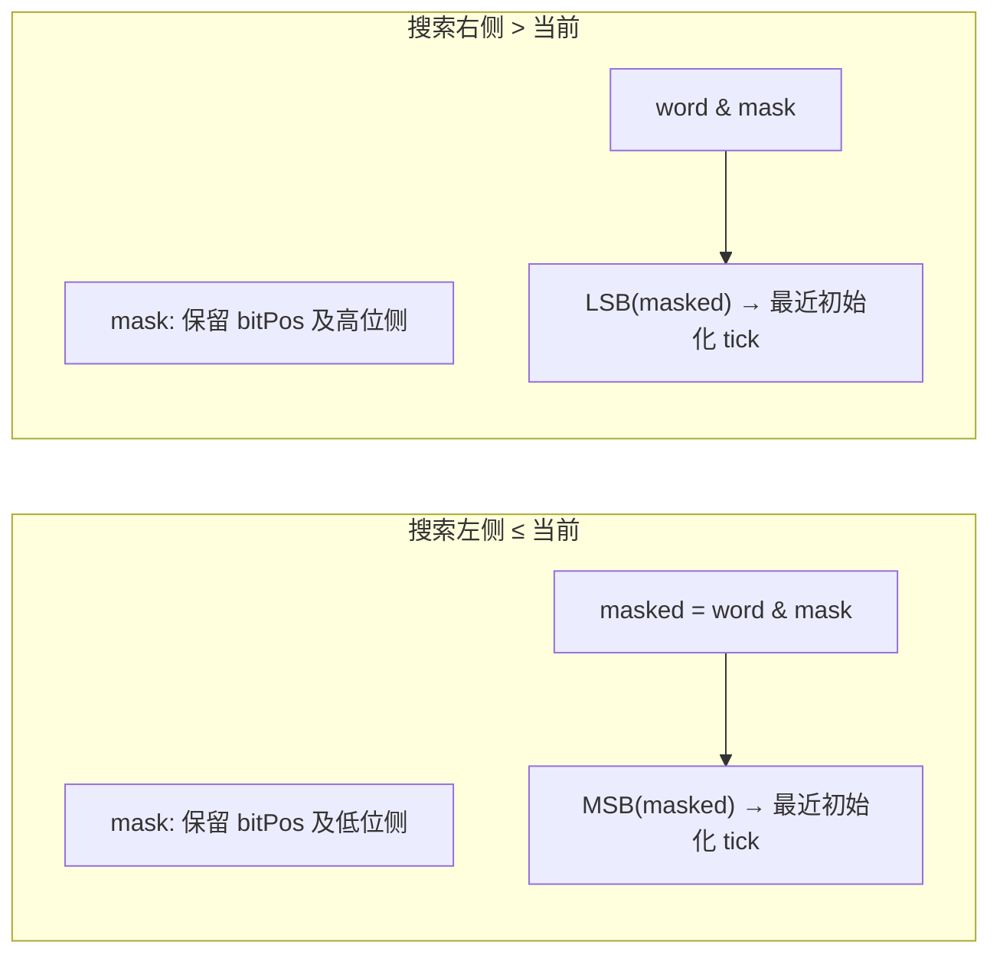

### 源码

```16:40:src/libraries/TickBitmap.sol
    function compress(int24 tick, int24 tickSpacing) internal pure returns (int24 compressed) {
        assembly ("memory-safe") {
            tick := signextend(2, tick)
            tickSpacing := signextend(2, tickSpacing)
            compressed :=
                sub(
                    sdiv(tick, tickSpacing),
                    slt(smod(tick, tickSpacing), 0)
                )
        }
    }

    function position(int24 tick) internal pure returns (int16 wordPos, uint8 bitPos) {
        assembly ("memory-safe") {
            wordPos := sar(8, signextend(2, tick))
            bitPos := and(tick, 0xff)
        }
    }
```

```47:120:src/libraries/TickBitmap.sol
    function flipTick(mapping(int16 => uint256) storage self, int24 tick, int24 tickSpacing) internal {
        assembly ("memory-safe") {
            tick := signextend(2, tick)
            tickSpacing := signextend(2, tickSpacing)
            if smod(tick, tickSpacing) {
                let fmp := mload(0x40)
                mstore(fmp, 0xd4d8f3e6)
                mstore(add(fmp, 0x20), tick)
                mstore(add(fmp, 0x40), tickSpacing)
                revert(add(fmp, 0x1c), 0x44)
            }
            tick := sdiv(tick, tickSpacing)
            mstore(0, sar(8, tick))
            mstore(0x20, self.slot)
            let slot := keccak256(0, 0x40)
            sstore(slot, xor(sload(slot), shl(and(tick, 0xff), 1)))
        }
    }

    function nextInitializedTickWithinOneWord(
        mapping(int16 => uint256) storage self,
        int24 tick,
        int24 tickSpacing,
        bool lte
    ) internal view returns (int24 next, bool initialized) {
        unchecked {
            int24 compressed = compress(tick, tickSpacing);

            if (lte) {
                (int16 wordPos, uint8 bitPos) = position(compressed);
                uint256 mask = type(uint256).max >> (uint256(type(uint8).max) - bitPos);
                uint256 masked = self[wordPos] & mask;

                initialized = masked != 0;
                next = initialized
                    ? (compressed - int24(uint24(bitPos - BitMath.mostSignificantBit(masked)))) * tickSpacing
                    : (compressed - int24(uint24(bitPos))) * tickSpacing;
            } else {
                (int16 wordPos, uint8 bitPos) = position(++compressed);
                uint256 mask = ~((1 << bitPos) - 1);
                uint256 masked = self[wordPos] & mask;

                initialized = masked != 0;
                next = initialized
                    ? (compressed + int24(uint24(BitMath.leastSignificantBit(masked) - bitPos))) * tickSpacing
                    : (compressed + int24(uint24(type(uint8).max - bitPos))) * tickSpacing;
            }
        }
    }
```

### 隐藏细节

- **`compress` 里 `slt(smod(tick, tickSpacing), 0)`**：Solidity 的 `a % b` 与 `smod` 在 **负 tick** 上符号规则一致；非整除时余数为负当且仅当 `tick < 0`，此时要向 $-\infty$ **多减 1**。
- **`position` 的 `tick` 实为已压缩索引**：`flipTick` 里先 `tick := sdiv(tick, tickSpacing)`，再 `sar(8,tick)` 与 `and(tick,0xff)` — 每字 **256 个压缩 tick**，与 `int16` mapping key 对齐。
- **`flipTick` 的 `mload(0x40)`**：在 **内存安全汇编** 里用 free memory pointer 拼 `TickMisaligned` 的 ABI 编码，避免覆盖固定 scratch 以外区域；`revert(add(fmp,0x1c), 0x44)` 跳过 selector 偏移。
- **`nextInitializedTickWithinOneWord` 的 `lte` 掩码**：`type(uint256).max >> (255 - bitPos)` 保留 **从 bitPos 到最低位**，也就是“当前位及低位侧”；再配合 **MSB** 找到 **≤ 当前位的最高初始化位**。
- **`!lte` 分支 `++compressed`**：故意从 **下一格** 开始，使「严格大于当前 tick」的搜索 **不包含当前位**（与注释 *current tick state doesn't matter* 一致）。
- **注释中的 overflow**：`compressed ± int24(uint24(...))` 在极端 tick/spacing 下可能越界，注释写明由 **Pool 对 tick 的全局限制**保证安全，库本身不单独检查。

---

## 库依赖关系（总图）

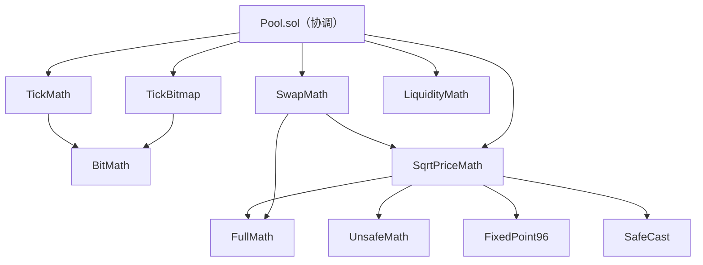

---

## 速查表

| 库 | 核心技巧 |
|----|----------|
| `FullMath` | 512 位乘积 + 奇分母模逆，消灭 phantom overflow |
| `UnsafeMath` | 汇编 `ceil`、无检查 `mul/div` |
| `BitMath` | 二分 + 表查 MSB；`x & -x` + 特制常数查表 LSB |
| `TickMath` | tick 按位乘 Q128.128 常数；Q128.96/`uint160` 收尾；`log₂` 迭代 + 误差校正 tick |
| `SqrtPriceMath` | 双路径防溢出；舍入与 swap 方向一致；`mulmod` 优化舍入 |
| `SwapMath` | 汇编选目标价；exact in/out 与 pips 扣费 |
| `LiquidityMath` | 汇编加总 + `shr(128,z)` 判 uint128 溢出 |
| `TickBitmap` | `sdiv/smod` 压缩；XOR 翻位；掩码 + MSB/LSB |
| `ProtocolFeeLibrary` | 12+12 打包；合成 swap 费一次算清 |

---
